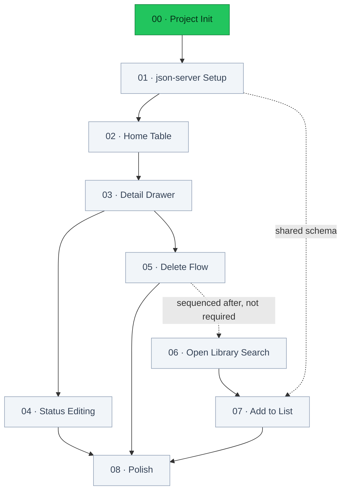
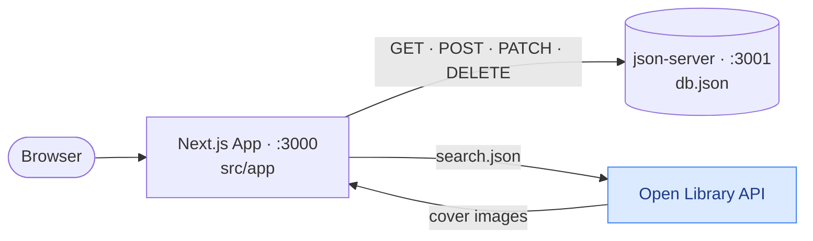

# Reading List

A personal book reading list tracker — track books you've read, are currently reading, or want to read. No login, no real database.

## Status

**1 of 9 features complete.**

| #   | Feature                                 | Status         |
| --- | --------------------------------------- | -------------- |
| 00  | Project Init & Boilerplate Cleanup      | ✅ Done        |
| 01  | Project & json-server Setup             | ⬜ Not started |
| 02  | Home Page — Read-Only Table             | ⬜ Not started |
| 03  | Book Detail Drawer — View Only          | ⬜ Not started |
| 04  | Status Editing (Drawer)                 | ⬜ Not started |
| 05  | Delete Flow (Drawer)                    | ⬜ Not started |
| 06  | Search View — Open Library Results      | ⬜ Not started |
| 07  | Add-to-List + "Already Added" Detection | ⬜ Not started |
| 08  | Polish — Loading/Empty/Error States     | ⬜ Not started |

Specs for each live in [`context/features/`](context/features/).

## Roadmap

Solid arrows are hard dependencies taken from each spec's **Depends On** section; the dotted arrow is sequencing only.



## Architecture

There is no real backend. `json-server` stands in for one, and the browser talks to both it and Open Library directly.



## Getting Started

Two processes run side by side in development.

```bash
npm run dev                                    # Next.js dev server on :3000
npx json-server --watch db.json --port 3001    # fake REST API on :3001, second terminal
```

Open [http://localhost:3000](http://localhost:3000).

Other commands:

```bash
npm run build    # production build
npm start        # serve the production build
npm run lint     # eslint
```

`npm start` serves the Next.js app only — json-server still needs to be running separately for data to load.

> `db.json` does not exist yet; it arrives in feature 01.

## Tech Stack

| Category  | Technology           | Notes                                   |
| --------- | -------------------- | --------------------------------------- |
| Framework | Next.js (App Router) | Server components by default            |
| Language  | TypeScript           | Strict mode                             |
| Styling   | Tailwind CSS         | Plain utilities, no component library   |
| Data      | json-server          | Fake REST API over `db.json`            |
| Search    | Open Library API     | No key required, used when adding books |
| Auth      | None                 | Single-user, local use                  |

## Project Structure

```
src/app/           # App Router pages and layout
context/           # Project docs and numbered feature specs
.claude/skills/    # Workflow skills
public/            # Static assets
```

## Development Workflow

Every feature follows the same loop, defined in [`context/ai-interaction.md`](context/ai-interaction.md) and automated by the `implement-feature` skill.

```mermaid
flowchart LR
    A["1 · Document<br/>current-feature.md"] --> B["2 · Branch<br/>feature/*"]
    B --> C["3 · Implement<br/>one part at a time"]
    C --> D["4 · Test<br/>browser + npm run build"]
    D -->|"issues found"| C
    D --> E["5 · Commit<br/>/commit-msg"]
    E --> F["6 · Merge"]
    F --> G["7 · Delete branch"]
    G --> H["8 · Review"]
    H --> I["9 · README<br/>/update-readme"]
    I --> J["10 · Close out"]

    classDef gate fill:#fef3c7,stroke:#f59e0b,color:#78350f
    class E,G gate
```



Amber steps need explicit approval before they run.

## Build Log

### 00 — Project Init & Boilerplate Cleanup

`888de9b` · merged in `1732bb4`

**Shipped** — App Router relocated from `app/` to `src/app/`; `page.tsx` reduced to a single "Reading List" heading; `globals.css` cut to just the Tailwind import; starter metadata replaced with the real title and description.

**Decisions** — The `@/*` path alias was repointed from `./*` to `./src/*` alongside the move, so later imports resolve inside the new tree. Geist fonts were dropped rather than kept: stripping `globals.css` to one line removes the `@theme` block that wired them into Tailwind's `font-sans`, so keeping them would have left dead CSS variables. The unused `next.svg` and `vercel.svg` logos were deleted.

**Notes** — Project docs, feature specs, and the workflow skills landed separately in `cb7ce58` and `2d19382`. Feature 02 will need the three `--color-status-*` custom properties in `globals.css`, which will take it past this feature's "only the Tailwind import" criterion.
