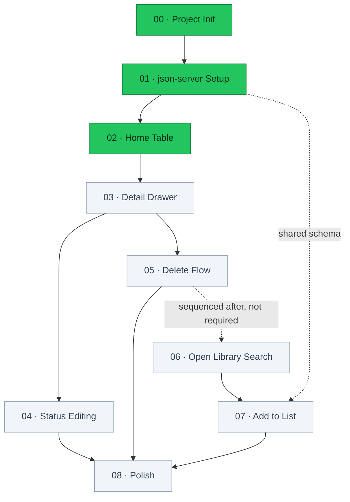

# Reading List

A personal book reading list tracker — track books you've read, are currently reading, or want to read. No login, no real database.

## Status

**3 of 9 features complete.**

| #   | Feature                                 | Status         |
| --- | --------------------------------------- | -------------- |
| 00  | Project Init & Boilerplate Cleanup      | ✅ Done        |
| 01  | Project & json-server Setup             | ✅ Done        |
| 02  | Home Page — Read-Only Table             | ✅ Done        |
| 03  | Book Detail Drawer — View Only          | ⬜ Not started |
| 04  | Status Editing (Drawer)                 | ⬜ Not started |
| 05  | Delete Flow (Drawer)                    | ⬜ Not started |
| 06  | Search View — Open Library Results      | ⬜ Not started |
| 07  | Add-to-List + "Already Added" Detection | ⬜ Not started |
| 08  | Polish — Loading/Empty/Error States     | ⬜ Not started |

Specs for each live in [`context/features/`](context/features/).

## Roadmap

Solid arrows are hard dependencies taken from each spec's **Depends On** section; the dotted arrow is sequencing only.



## Architecture

There is no real backend. `json-server` stands in for one, and the browser talks to both it and Open Library directly.


## Getting Started

Two processes run side by side in development, but `concurrently` starts both from one command — no second terminal needed.

```bash
npm install
npm run db:reset   # creates db.json from db.seed.json (first run only)
npm run dev        # Next.js (:3000) + json-server (:3001), together
```

Open [http://localhost:3000](http://localhost:3000). The API is at [http://localhost:3001/books](http://localhost:3001/books).

Other commands:

```bash
npm run dev:next   # Next.js only, for isolating a Next.js-specific issue
npm run dev:api    # json-server only, for isolating a data/API issue
npm run db:reset   # restore db.json to the 6 seeded books
npm run build      # production build
npm start          # serve the production build
npm run lint       # eslint
```

`npm start` serves the Next.js app only — json-server still needs to be running (`npm run dev:api`) for data to load.

### Seed data vs. working data

`db.seed.json` is the committed source of truth. `db.json` is the disposable working copy json-server reads and writes, and is gitignored — `npm run db:reset` recreates it. Change the starting data by editing `db.seed.json`, not `db.json`.

Stop json-server before running `db:reset`: a running server keeps serving its in-memory copy and will not pick up the rewritten file.

## Tech Stack

| Category  | Technology           | Notes                                   |
| --------- | -------------------- | --------------------------------------- |
| Framework | Next.js (App Router) | Server components by default            |
| Language  | TypeScript           | Strict mode                             |
| Styling   | Tailwind CSS         | Plain utilities, no component library   |
| Data      | json-server          | Fake REST API over `db.json`            |
| Search    | Open Library API     | No key required, used when adding books |
| Auth      | None                 | Single-user, local use                  |

## Project Structure

```
src/app/           # App Router pages and layout
src/components/    # UI components, grouped by feature area
src/hooks/         # Client hooks — useBooks wraps the json-server fetch
src/lib/           # json-server.ts — typed fetch helpers
src/types/         # book.ts — Book and BookStatus
context/           # Project docs and numbered feature specs
scripts/           # reset-db.js — rebuilds db.json from the seed
.claude/skills/    # Workflow skills
public/            # Static assets
db.seed.json       # Committed seed data (source of truth)
db.json            # Working API data, gitignored — regenerate with npm run db:reset
```

## Development Workflow

Every feature follows the same loop, defined in [`context/ai-interaction.md`](context/ai-interaction.md) and automated by the `implement-feature` skill.

```mermaid
flowchart LR
    A["1 · Document<br/>current-feature.md"] --> B["2 · Branch<br/>feature/*"]
    B --> C["3 · Implement<br/>one part at a time"]
    C --> D["4 · Test<br/>browser + npm run build"]
    D -->|"issues found"| C
    D --> E["5 · Commit<br/>/commit-msg"]
    E --> F["6 · Merge"]
    F --> G["7 · Delete branch"]
    G --> H["8 · Review"]
    H --> I["9 · README<br/>/update-readme"]
    I --> J["10 · Close out"]

    classDef gate fill:#fef3c7,stroke:#f59e0b,color:#78350f
    class E,G gate
```



Amber steps need explicit approval before they run.

## Build Log

### 00 — Project Init & Boilerplate Cleanup

`888de9b` · merged in `1732bb4`

**Shipped** — App Router relocated from `app/` to `src/app/`; `page.tsx` reduced to a single "Reading List" heading; `globals.css` cut to just the Tailwind import; starter metadata replaced with the real title and description.

**Decisions** — The `@/*` path alias was repointed from `./*` to `./src/*` alongside the move, so later imports resolve inside the new tree. Geist fonts were dropped rather than kept: stripping `globals.css` to one line removes the `@theme` block that wired them into Tailwind's `font-sans`, so keeping them would have left dead CSS variables. The unused `next.svg` and `vercel.svg` logos were deleted.

**Notes** — Project docs, feature specs, and the workflow skills landed separately in `cb7ce58` and `2d19382`. Feature 02 will need the three `--color-status-*` custom properties in `globals.css`, which will take it past this feature's "only the Tailwind import" criterion.

### 01 — Project & json-server Setup

`282861f` · `1a91c03` · merged in `37e86c0`

**Shipped** — `db.seed.json` with six books covering all three statuses, `scripts/reset-db.js` and a `db:reset` script that rebuilds `db.json` from it, `json-server` and `concurrently` as devDependencies, and `dev` / `dev:next` / `dev:api` scripts. All four CRUD verbs verified against `http://localhost:3001/books` before any UI work.

**Decisions** — Seed data uses real Open Library keys and cover ids pulled from `search.json`, so covers actually resolve when feature 02 renders them. `json-server` stayed on `1.0.0-beta.15` rather than pinning stable `0.17.x`: v1 generates string ids, matching the `"id": "1"` shape the schema already specified. `dev` delegates through `concurrently`'s `npm:` shorthand so `dev:api` is defined in one place.

**Fixes** — The documented `json-server --watch db.json --port 3001` was v0.17 syntax and fails on v1, which dropped `--watch`; corrected in `CLAUDE.md` and the spec. The `olKey` example in `project-overview.md` showed a bare `OL66554W` while the search API returns `/works/OL66554W`, and both `coding-standards.md` and feature 07 specify comparing that `key` against `olKey` directly — seeding the bare form would have made every "Already Added" check miss and allow duplicates, so the example now carries the prefix. Verifying `db:reset` surfaced that a running json-server ignores an externally overwritten file and keeps serving stale data; it needs a restart, now documented.

### 02 — Home Page: Read-Only Table

`6fefb8c` · merged in `8c791e1`

**Shipped** — `Book` / `BookStatus` types, a `getBooks` helper in `src/lib/json-server.ts`, a `useBooks` hook, the `StatusBadge` and `StarScore` primitives, and `BookTable`. The home page renders all six seeded books across Name / Type / Status / Score / Author / Link, with distinct loading, empty, and error states.

**Decisions** — Status colours became six `@theme` tokens rather than the three in `project-overview.md`. The design reference draws each status as a pale tint under dark text of the same hue, and a single hex cannot fill both roles above ~2.3:1 contrast, so every status gained a darker `-ink` companion. `STATUS_STYLES` holds the display label next to the classes, keeping `currently_reading` → "Currently Reading" in one place for feature 04's dropdown. Data loads client-side via `useBooks`, not in a server component — that is what makes a genuine loading state possible and what features 04 and 05 need for mutations, leaving `page.tsx` as the only server component. The design's Add Book button and pagination row were omitted as they would be dead controls until features 06-07. An error state was added beyond the spec's requirements, since `coding-standards.md` forbids letting a failed fetch render nothing; it is what surfaces "is json-server running on port 3001". The `useBooks` hook sits in a new `src/hooks/` folder, which the File Organization list in `coding-standards.md` does not yet mention.
