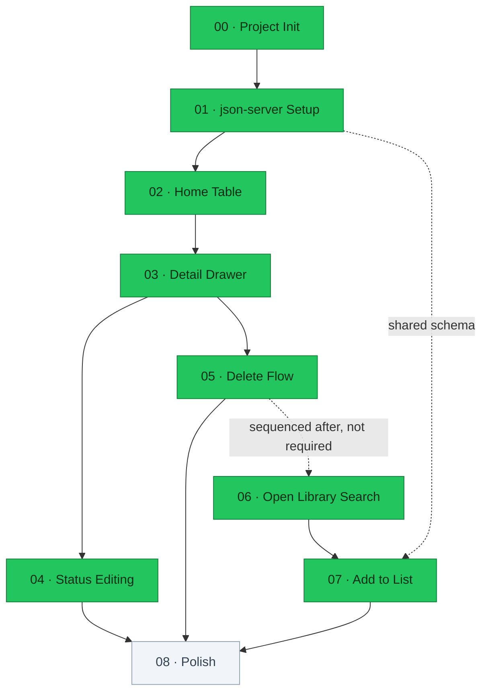

# Reading List

A personal book reading list tracker — track books you've read, are currently reading, or want to read. No login, no real database.

## Status

**8 of 9 features complete.**

| #   | Feature                                 | Status         |
| --- | --------------------------------------- | -------------- |
| 00  | Project Init & Boilerplate Cleanup      | ✅ Done        |
| 01  | Project & json-server Setup             | ✅ Done        |
| 02  | Home Page — Read-Only Table             | ✅ Done        |
| 03  | Book Detail Drawer — View Only          | ✅ Done        |
| 04  | Status Editing (Drawer)                 | ✅ Done        |
| 05  | Delete Flow (Drawer)                    | ✅ Done        |
| 06  | Search View — Open Library Results      | ✅ Done        |
| 07  | Add-to-List + "Already Added" Detection | ✅ Done        |
| 08  | Polish — Loading/Empty/Error States     | ⬜ Not started |

Specs for each live in [`context/features/`](context/features/).

## Roadmap

Solid arrows are hard dependencies taken from each spec's **Depends On** section; the dotted arrow is sequencing only.



## Architecture

There is no real backend. `json-server` stands in for one, and the browser talks to both it and Open Library directly.


## Getting Started

Two processes run side by side in development, but `concurrently` starts both from one command — no second terminal needed.

```bash
npm install
npm run db:reset   # creates db.json from db.seed.json (first run only)
npm run dev        # Next.js (:3000) + json-server (:3001), together
```

Open [http://localhost:3000](http://localhost:3000). The API is at [http://localhost:3001/books](http://localhost:3001/books).

Other commands:

```bash
npm run dev:next   # Next.js only, for isolating a Next.js-specific issue
npm run dev:api    # json-server only, for isolating a data/API issue
npm run db:reset   # restore db.json to the 6 seeded books
npm run build      # production build
npm start          # serve the production build
npm run lint       # eslint
```

`npm start` serves the Next.js app only — json-server still needs to be running (`npm run dev:api`) for data to load.

### Seed data vs. working data

`db.seed.json` is the committed source of truth. `db.json` is the disposable working copy json-server reads and writes, and is gitignored — `npm run db:reset` recreates it. Change the starting data by editing `db.seed.json`, not `db.json`.

Stop json-server before running `db:reset`: a running server keeps serving its in-memory copy and will not pick up the rewritten file.

## Tech Stack

| Category  | Technology           | Notes                                   |
| --------- | -------------------- | --------------------------------------- |
| Framework | Next.js (App Router) | Server components by default            |
| Language  | TypeScript           | Strict mode                             |
| Styling   | Tailwind CSS         | Plain utilities, no component library   |
| Data      | json-server          | Fake REST API over `db.json`            |
| Search    | Open Library API     | No key required, used when adding books |
| Auth      | None                 | Single-user, local use                  |

## Project Structure

```
src/app/           # App Router pages and layout
src/components/    # UI components, grouped by feature area
src/hooks/         # Client hooks — useBooks (json-server), useBookSearch (Open Library)
src/lib/           # json-server.ts, open-library.ts — typed fetch helpers
src/types/         # book.ts, open-library.ts — data models and API shapes
context/           # Project docs and numbered feature specs
context/understanding/  # Post-merge code walkthroughs, one per feature
scripts/           # reset-db.js — rebuilds db.json from the seed
.claude/skills/    # Workflow skills
public/            # Static assets
db.seed.json       # Committed seed data (source of truth)
db.json            # Working API data, gitignored — regenerate with npm run db:reset
```

## Development Workflow

Every feature follows the same loop, defined in [`context/ai-interaction.md`](context/ai-interaction.md) and automated by the `implement-feature` skill.

```mermaid
flowchart LR
    A["1 · Document<br/>current-feature.md"] --> B["2 · Branch<br/>feature/*"]
    B --> C["3 · Implement<br/>one part at a time"]
    C --> D["4 · Test<br/>browser + npm run build"]
    D -->|"5 · Iterate"| C
    D --> E["6 · Commit<br/>/commit-msg"]
    E --> F["7 · Merge"]
    F --> G["8 · Delete branch"]
    G --> H["9 · Review"]
    H --> I["10 · README<br/>/update-readme"]
    I --> J["11 · Explain<br/>/understand-feature"]
    J --> K["12 · Close out"]

    classDef gate fill:#fef3c7,stroke:#f59e0b,color:#78350f
    class E,G,J gate
```



Amber steps need explicit approval before they run. Step 11 is optional and always offered as a yes/no — the note in `context/understanding/` is a learning reference, not something the build or the next feature depends on.

## Build Log

### 00 — Project Init & Boilerplate Cleanup

`888de9b` · merged in `1732bb4`

**Shipped** — App Router relocated from `app/` to `src/app/`; `page.tsx` reduced to a single "Reading List" heading; `globals.css` cut to just the Tailwind import; starter metadata replaced with the real title and description.

**Decisions** — The `@/*` path alias was repointed from `./*` to `./src/*` alongside the move, so later imports resolve inside the new tree. Geist fonts were dropped rather than kept: stripping `globals.css` to one line removes the `@theme` block that wired them into Tailwind's `font-sans`, so keeping them would have left dead CSS variables. The unused `next.svg` and `vercel.svg` logos were deleted.

**Notes** — Project docs, feature specs, and the workflow skills landed separately in `cb7ce58` and `2d19382`. Feature 02 will need the three `--color-status-*` custom properties in `globals.css`, which will take it past this feature's "only the Tailwind import" criterion.

### 01 — Project & json-server Setup

`282861f` · `1a91c03` · merged in `37e86c0`

**Shipped** — `db.seed.json` with six books covering all three statuses, `scripts/reset-db.js` and a `db:reset` script that rebuilds `db.json` from it, `json-server` and `concurrently` as devDependencies, and `dev` / `dev:next` / `dev:api` scripts. All four CRUD verbs verified against `http://localhost:3001/books` before any UI work.

**Decisions** — Seed data uses real Open Library keys and cover ids pulled from `search.json`, so covers actually resolve when feature 02 renders them. `json-server` stayed on `1.0.0-beta.15` rather than pinning stable `0.17.x`: v1 generates string ids, matching the `"id": "1"` shape the schema already specified. `dev` delegates through `concurrently`'s `npm:` shorthand so `dev:api` is defined in one place.

**Fixes** — The documented `json-server --watch db.json --port 3001` was v0.17 syntax and fails on v1, which dropped `--watch`; corrected in `CLAUDE.md` and the spec. The `olKey` example in `project-overview.md` showed a bare `OL66554W` while the search API returns `/works/OL66554W`, and both `coding-standards.md` and feature 07 specify comparing that `key` against `olKey` directly — seeding the bare form would have made every "Already Added" check miss and allow duplicates, so the example now carries the prefix. Verifying `db:reset` surfaced that a running json-server ignores an externally overwritten file and keeps serving stale data; it needs a restart, now documented.

### 02 — Home Page: Read-Only Table

`6fefb8c` · merged in `8c791e1`

**Shipped** — `Book` / `BookStatus` types, a `getBooks` helper in `src/lib/json-server.ts`, a `useBooks` hook, the `StatusBadge` and `StarScore` primitives, and `BookTable`. The home page renders all six seeded books across Name / Type / Status / Score / Author / Link, with distinct loading, empty, and error states.

**Decisions** — Status colours became six `@theme` tokens rather than the three in `project-overview.md`. The design reference draws each status as a pale tint under dark text of the same hue, and a single hex cannot fill both roles above ~2.3:1 contrast, so every status gained a darker `-ink` companion. `STATUS_STYLES` holds the display label next to the classes, keeping `currently_reading` → "Currently Reading" in one place for feature 04's dropdown. Data loads client-side via `useBooks`, not in a server component — that is what makes a genuine loading state possible and what features 04 and 05 need for mutations, leaving `page.tsx` as the only server component. The design's Add Book button and pagination row were omitted as they would be dead controls until features 06-07. An error state was added beyond the spec's requirements, since `coding-standards.md` forbids letting a failed fetch render nothing; it is what surfaces "is json-server running on port 3001". The `useBooks` hook sits in a new `src/hooks/` folder, which the File Organization list in `coding-standards.md` does not yet mention.

### 03 — Book Detail Drawer: View Only

`fba1045` · merged in `d834ba8`

**Shipped** — `BookDrawer`, a panel that slides in when a table row is clicked, showing the cover, title, type, author, link, score, and a static status badge. It closes via the bare `×` or the backdrop, fills the viewport below 768px, and sits as a 400px right-hand panel above that. `StarScore` gained a `size` prop for the design's two star sizes (14px in the table, 17px in the drawer), and `covers.openlibrary.org` is allow-listed in `next.config.ts` so `next/image` can serve covers.

**Decisions** — The selected book id and the drawer's open state are tracked separately in `ReadingList`: closing clears only `isDrawerOpen`, so the panel still has content to render while sliding out, and re-deriving the book with `books.find` each render keeps it on live data for feature 04's status edit. The overlay stays mounted rather than mounting on open, since a panel mounted in its final position has nothing to animate from; `inert` keeps it out of the tab order while closed. Rows carry the click for pointers while the title cell is a real `<button>` for keyboard users, avoiding `role="button"` on a `<tr>`, and the Open Library link stops propagation so it doesn't also open the drawer. The design's status `<select>`, Delete button, and Notes / Added / Finished fields were left out — the first two belong to features 04 and 05, and the last three have no fields in the `Book` model.

**Fixes** — The drawer was first built from feature 02's table styling instead of the design file and diverged structurally: a bordered header rather than the centred cover-and-title stack, the wrong field order, and a 440px panel instead of 400px. It was re-laid out against `Reading List.dc.html` before the commit. The design had looked unreachable because the claude-design MCP server was unregistered, and its import tools only load in the session *after* registration — but the `DesignSync` read methods reach the same project without them. `project-overview.md` had described the file as "a design reference... use it for layout, spacing, and visual details", wording that invited the approximation, and now states it is the strict source of truth to be read before building. Two React Compiler lint rules (`set-state-in-effect` and `refs`) rejected the first two attempts at retaining the closing panel's content, which is what pushed that state up into `ReadingList`.

### 04 — Status Editing (Drawer)

`76f9a25` · merged in `51a89a1`

**Shipped** — `updateBookStatus` in `src/lib/json-server.ts` (`PATCH /books/:id`), an `updateStatus` mutation on `useBooks`, and `StatusSelect`, which replaces the drawer's static badge. Changing status writes through to `db.json` and the table's badge recolours without a reload. A failed save renders an error under the control. Labels and the option order moved to `src/lib/book-status.ts`, shared with `StatusBadge`.

**Decisions** — `updateStatus` rejects on failure instead of storing the error in the hook: `useBooks`' existing `error` swaps the whole table for an error state, which is right for a failed load and wrong for a failed save, so the drawer catches it and reports it beside the select. Local state is updated from the book json-server returns rather than from what was sent, and there is no optimistic update — on failure the select snaps back to the stored value, so the UI never shows a status that didn't persist. The in-flight book and the error are both tracked by book id, not booleans, because the permanently-mounted drawer only swaps its `book` prop and a late rejection would otherwise be reported against whichever book is on screen. Feature 02 had put display labels in `StatusBadge`'s `STATUS_STYLES` for this dropdown to reuse; the labels and status order are now in `src/lib/book-status.ts`, while the pill tints stayed in `StatusBadge` as its only consumer. Two additions the design doesn't cover: disabled styling while a PATCH is in flight, and the error message the spec requires.

**Fixes** — The select was first built as a tinted pill extrapolated from `StatusBadge`, because the claude-design MCP returned a consent error on every read and the work continued anyway. Feature 03 had already established the design file as the strict source of truth, so this was the same mistake a second time. Once `/design consent` was granted the design was read and the control rebuilt from it — every dimension of the guess was wrong: the design specifies a full-width white box with a 1px border, 8px radius, 14px ink text and the platform's own select chrome, deliberately *not* the table's pill, with options ordered Want to Read → Currently Reading → Read rather than the reverse. An unreadable design is now treated as a blocker rather than something to work around.

### 05 — Delete Flow (Drawer)

`70bf420` · merged in `621bbcb`

**Shipped** — `deleteBook` in `src/lib/json-server.ts` (`DELETE /books/:id`), a `removeBook` mutation on `useBooks`, and the design's `Delete Book` button at the foot of the drawer. Clicking it raises a confirmation card centred over the panel, with the fields behind dimmed and blurred; confirming removes the book from `db.json` and the table and closes the drawer, cancelling leaves the data untouched. A failed delete reports inside the popup and keeps it open.

**Decisions** — The confirmation is the only deviation from the design, which ends the drawer with a `Delete Book` button that deletes on a single click and has no confirm UI at all; the spec explicitly overrides that, so the idle button matches the design exactly and the confirm step was built. It started as an inline confirm swapped in place of the button and became a centred popup on review. The popup is a sibling of the panel rather than a child of it — the panel scrolls, and an overlay inside it would scroll away from the fields it is meant to be covering — and it shares the panel's geometry so the dimming stays inside the drawer and the table keeps its own backdrop. It introduces no new colour: the card border and the filled `Delete` reuse the two reds the design already names for the delete button. `removeBook` rejects on failure rather than storing the error in the hook, and drops the book from local state instead of refetching, both following feature 04's `updateStatus`. The armed confirm is keyed by book id like the state around it, the panel goes `inert` behind the popup so blurred fields leave the tab order, and closing disarms the confirm except while a delete is in flight, since leaving mid-request would remove the element its failure message renders in. That last guard is why the success path calls `onClose` directly instead of the guarded `handleClose`, which would otherwise refuse the close it just earned.

### 06 — Search View: Open Library Results

`c335351` · merged in `843b23b` · `b916280`

**Shipped** — A `/search` route rendering the design's dark card grid: `searchBooks` in `src/lib/open-library.ts`, a debounced `useBookSearch` hook, `OpenLibraryDoc` / `SearchResult` types, and `SearchBooks` + `SearchResultCard`. Each card carries the cover, title, author, and star rating, with all four states handled — idle, loading, no results, and API error. Five dark `@theme` tokens were added for the palette, `StarScore` gained a 13px `size` and a `tone` for the darker empty star, and the design's `+ Add Book` button now sits in the home header and empty state.

**Decisions** — The request adds `fields=` to the spec's bare `?q={query}`: `ratings_average` is absent from the default response, so there is no other way to render the design's stars. It also caps at 24 results, since the API pages at 100. Search fires on typing behind a 400ms debounce rather than on submit, because the design's input has no submit control and adding one would be a visible deviation. Only `author_name[0]` is shown — Open Library credits translators and narrators in that array, and the card gives the author one line. The hook stores a single record tagged with the query it answered and derives everything else from whether that tag still matches the box, so a stale result set can never be shown as this query's answer and the debounce window itself reads as loading. A card's stars are Open Library's community rating, display only; feature 07 still adds books at `score: 0`, since the list's score is the user's own. The four state panels are a deviation — the design has none at all — and mirror the home page's, translated into the dark palette. The `+ Add Book` entry point is beyond the spec but is the design's own button in its own position, without which `/search` is only reachable by typing the URL.

**Fixes** — Lint's `react-hooks/set-state-in-effect` rejected the hook's clear-on-empty branch, which is what pushed it from stored state to derived state. A `py-16` written over the shared panel constant's `py-24` was not the override it looked like: conflicting Tailwind utilities resolve by stylesheet order, not class order, so each panel now sets its own. The input was `type="search"`, which has the browser draw a clear "×" the design's plain input does not have. Post-merge review caught an `aria-live` region wrapping the whole grid, which made every search read out all two dozen cards; it is now a visually-hidden summary with the grid outside it, and `buildCoverUrl` lost an export that had no consumer.

### 07 — Add-to-List + "Already Added" Detection

`1deb87e` · merged in `55df4f2`

**Shipped** — `createBook` in `src/lib/json-server.ts` (`POST /books`), a `NewBook` type, a `toNewBook` mapping in `src/lib/open-library.ts`, and an `addBook` mutation on `useBooks`. Each search card now ends in the design's `Add` button, or its muted `Already Added` label when the book is already in the list. Adding writes a full record to `db.json` at `status: "want_to_read"` and `score: 0`, and the card flips to `Already Added` the moment the POST resolves — no re-search, and the state survives one.

**Decisions** — Matching is on `olKey` and never on title, which is the whole reason this is its own feature: a search for "The Hobbit" returns Tolkien's work alongside several unrelated ones, and title matching would mask them all as added. The added keys are a memoized `Set`, so the check is a lookup per card rather than a scan of the list. Three fields have no source in the search response: `type` is stored as `"Unknown"` rather than reaching for `subject`, which is a crowd-edited pile as likely to read "Accessible book, Protected DAISY" as a genre; `link` is the `olKey` resolved against `openlibrary.org`, the one URL Open Library gives for a work; and `score` is `0`, not the card's stars, which are the community rating rather than the user's own. `useBooks` takes a `NewBook` rather than a `SearchResult`, keeping the books hook clear of Open Library types, and `addBook` rejects on failure and appends the created book instead of refetching, following features 04 and 05. The in-flight card and its error are keyed by `olKey` for the same reason those features key by book id. Three additions the design has no notion of: the disabled `Adding…` state, a per-card failure message, and a notice when `GET /books` itself fails — without the list there is nothing to compare against, and every card would silently offer to add a book that may already be there.

**Fixes** — A result Open Library has no cover for stores an empty `coverUrl`, which `next/image` treats as an error rather than as nothing to draw. The drawer was the only place still passing it through unguarded; it now renders the striped placeholder alone, as the search card already did.
