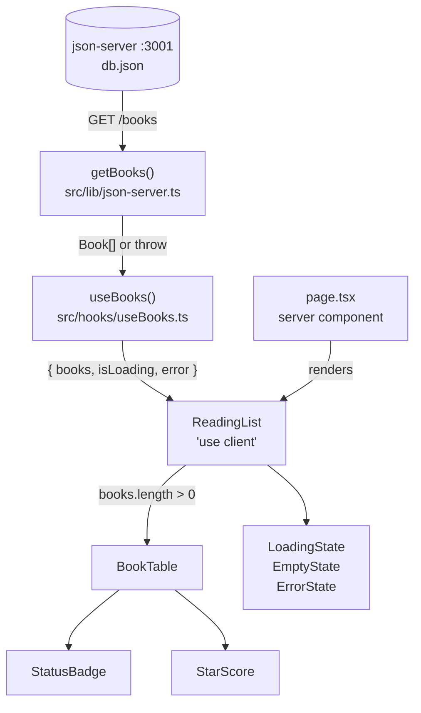

# 02 — Home Page: Read-Only Table

> How it actually works, read off the diff.
> Spec: [context/features/02-home-table-view.md](../features/02-home-table-view.md)
> Commits: `6fefb8c` (implementation) → merged in `8c791e1`, closed out by `a71efd1` (docs only)
> Base for the diff: `65c9288`

---

## 1. What this feature does, in plain language

Before this feature, the home page was a single centred `<h1>` reading "Reading
List". Feature 01 had put six books into `db.json` behind json-server on port
3001, but nothing in the app ever asked for them.

This feature connects those two ends. When you open `/`, the browser fetches
`GET http://localhost:3001/books`, and the six seeded books render as a
Notion-style table with six columns — Name, Type, Status, Score, Author, Link.
Status shows as a coloured pill, score as five stars with the filled ones in
amber. Nothing is clickable yet except the Open Library link; rows do nothing,
and there's no way to add or delete. That's deliberate — the spec's Goal says
"No interactivity yet."

Three things can be on screen instead of the table, and each looks clearly
different from the others:

| Situation                      | What you see                                                   |
| ------------------------------ | -------------------------------------------------------------- |
| Fetch still in flight          | White card, same shape as the table, "Loading your books…"      |
| Fetch succeeded, zero books    | Dashed-border card, "Your reading list is empty"                |
| Fetch failed                   | Red-tinted card naming the problem (usually: json-server is down) |

The error state was **not** in the spec. It was added because
[coding-standards.md](../coding-standards.md) says a failed fetch must never
silently render nothing.

---

## 2. Files, and the job each one does

Ten files touched; eight of them new. Read top-to-bottom, this is the data
travelling from json-server to the screen.

### New files

| File | Role |
| ---- | ---- |
| [src/types/book.ts](../../src/types/book.ts) | The `Book` shape and the `BookStatus` union. Everything else imports from here. |
| [src/lib/json-server.ts](../../src/lib/json-server.ts) | `getBooks()` — the one place that knows the API's URL and turns HTTP failures into readable messages. |
| [src/hooks/useBooks.ts](../../src/hooks/useBooks.ts) | Wraps `getBooks()` in React state: `{ books, isLoading, error }`. |
| [src/components/books/ReadingList.tsx](../../src/components/books/ReadingList.tsx) | The client boundary. Calls the hook and decides which of the four bodies to render. |
| [src/components/books/BookTable.tsx](../../src/components/books/BookTable.tsx) | Pure presentation: takes `Book[]`, renders the table. |
| [src/components/books/StatusBadge.tsx](../../src/components/books/StatusBadge.tsx) | Status → label + colour classes. Single source of truth for both. |
| [src/components/books/StarScore.tsx](../../src/components/books/StarScore.tsx) | Number 0–5 → five stars, `score` of them filled. |

### Changed files

| File | Change |
| ---- | ------ |
| [src/app/globals.css](../../src/app/globals.css) | Went from one line (`@import "tailwindcss"`) to also declaring six status colours in an `@theme` block. |
| [src/app/page.tsx](../../src/app/page.tsx) | Placeholder heading swapped for `<ReadingList />` inside the page container. |
| `context/current-feature.md` | Workflow bookkeeping — spec copied in, then reset in `a71efd1`. Not code. |

---

## 3. How the pieces connect



The chain is deliberately one-directional and each link only knows about the
one below it. `BookTable` has never heard of `fetch`; `getBooks` has never
heard of React.

### 3.1 `src/types/book.ts` — the contract

```ts
export type BookStatus = "read" | "currently_reading" | "want_to_read";

export interface Book {
  id: string;
  title: string;
  author: string;
  type: string;
  status: BookStatus;
  score: number;
  coverUrl: string;
  link: string;
  olKey: string;
}
```

Two things worth noticing:

- **`BookStatus` is a union of three string literals, not `string`.** This is
  what makes `STATUS_STYLES` in `StatusBadge` provably exhaustive — TypeScript
  refuses to compile a `Record<BookStatus, …>` that's missing a key. Add a
  fourth status later and the compiler points at the badge rather than letting
  it crash at runtime on `undefined.label`.
- **`Book` carries `coverUrl` and `olKey` even though this feature renders
  neither.** They're already in `db.json` from feature 01 and belong to the
  data model, not to any one screen. `coverUrl` gets used by feature 03 (the
  drawer's cover image), `olKey` by feature 07 (duplicate detection).

`id` is a `string`, matching what json-server v1 generates and what the schema
in [project-overview.md](../project-overview.md) specifies.

### 3.2 `src/lib/json-server.ts` — the fetch, and two kinds of failure

```ts
const API_BASE_URL = "http://localhost:3001";

export async function getBooks(): Promise<Book[]> {
  let response: Response;

  try {
    response = await fetch(`${API_BASE_URL}/books`);
  } catch {
    throw new Error(UNREACHABLE_MESSAGE);
  }

  if (!response.ok) {
    throw new Error(`Couldn't load your books (${response.status}).`);
  }

  return (await response.json()) as Book[];
}
```

The non-obvious bit is the **narrow `try` block**. It wraps *only* the `fetch`
call, not the `.json()` parse or the status check. That's on purpose, because
the two failure modes are genuinely different and deserve different messages:

- `fetch` **throws** only when the request never completed — DNS failure,
  connection refused, CORS block. In this app that almost always means one
  thing: json-server isn't running. So the message says exactly that
  ("Make sure json-server is running on port 3001"), which is the single most
  common way to break this app, and matches the debugging hint in
  [ai-interaction.md](../ai-interaction.md).
- A `404` or `500` **does not throw** — `fetch` resolves with `response.ok ===
  false`. That's a server that answered but refused, so the message carries the
  status code instead.

If the `try` had wrapped everything, a real `500` would have been reported as
"json-server isn't running", sending you to check a server that's plainly up.

The `as Book[]` cast is unchecked — nothing validates the response shape at
runtime. That's a deliberate project-wide choice:
[coding-standards.md](../coding-standards.md) explicitly rules out Zod, on the
grounds that `db.json` is hand-shaped to match the interface and there's no
real database writing unexpected shapes.

### 3.3 `src/hooks/useBooks.ts` — state around the fetch

```ts
export function useBooks(): UseBooksResult {
  const [books, setBooks] = useState<Book[]>([]);
  const [isLoading, setIsLoading] = useState(true);
  const [error, setError] = useState<string | null>(null);

  useEffect(() => {
    let cancelled = false;

    async function load() {
      try {
        const data = await getBooks();
        if (!cancelled) setBooks(data);
      } catch (caught) {
        if (!cancelled) {
          setError(
            caught instanceof Error
              ? caught.message
              : "Something went wrong loading your books.",
          );
        }
      } finally {
        if (!cancelled) setIsLoading(false);
      }
    }

    load();

    return () => { cancelled = true; };
  }, []);

  return { books, isLoading, error };
}
```

Four details that are easy to skim past:

1. **`isLoading` starts at `true`, not `false`.** The effect hasn't run yet on
   the very first render, so if it started `false` the component would flash
   the empty state ("Your reading list is empty") for one frame before the
   fetch resolved. Starting `true` means the first thing painted is always the
   loading card.

2. **The `cancelled` flag.** The effect's cleanup function sets it, and every
   `setState` is guarded by it. This stops state updates landing on a component
   that's already unmounted — which matters immediately, because React's
   StrictMode in dev mounts, unmounts, and remounts every component, running
   the effect twice. Without the guard the first (discarded) fetch would still
   try to write into a dead component.

3. **`caught instanceof Error`.** In TypeScript strict mode a `catch` binding
   is `unknown`, not `Error` — you can throw anything in JS. The check narrows
   it before touching `.message`, with a generic fallback. This is
   `coding-standards.md`'s "no `any`, use `unknown`" rule showing up in
   practice.

4. **`finally` clears `isLoading` on both paths.** Success and failure both end
   the loading state; only one of them sets `error`. That's what lets
   `ReadingList` treat loading / error / empty / populated as four clean
   mutually-exclusive branches.

The dependency array is `[]` — fetch once on mount, never refetch. There is no
`refetch` exposed yet. Features 04 and 05 will need one to reflect mutations.

### 3.4 `ReadingList.tsx` — the client boundary and the branch

This is the only component in the feature marked `"use client"`, and it is the
component that decides *what* to show:

```tsx
let body: ReactNode;
if (isLoading) {
  body = <LoadingState />;
} else if (error) {
  body = <ErrorState message={error} />;
} else if (books.length === 0) {
  body = <EmptyState />;
} else {
  body = <BookTable books={books} />;
}
```

Assigning to a `body` variable and rendering `{body}` once — rather than
nesting ternaries inside JSX — keeps the four cases readable and keeps the
`<header>` above them written exactly once.

**Order matters here.** `error` is checked before `books.length === 0`, because
on a failed fetch `books` is still its initial `[]`. Flip those two branches
and every failure would render as "Your reading list is empty" — technically
true, actively misleading.

The header shows a live count (`6 books`), with singular/plural handling, and
it's suppressed while loading or on error via `{!isLoading && !error && …}` —
otherwise you'd read "0 books" next to a spinner, or next to an error card.

`LoadingState`, `EmptyState`, and `ErrorState` are plain function components
declared in the same file below the default export. They're each a handful of
lines, used in exactly one place, and never rendered without `ReadingList`
choosing them — so giving each its own file would add imports without adding
reuse.

**On the client boundary:** `BookTable`, `StatusBadge`, and `StarScore` have no
`"use client"` directive of their own, but they still end up in the client
bundle. The directive marks a *boundary*, not a per-file label — everything
imported into a client component's tree becomes client code. They're left
undirected because they contain no hooks or browser APIs and would render fine
on the server too; only `ReadingList` genuinely needs to be a client component
(it calls `useState`/`useEffect` through `useBooks`).

### 3.5 `BookTable.tsx` — presentation only

Takes `books: Book[]`, renders a real semantic `<table>`. Headers come from a
module-level array so the six labels live in one place:

```tsx
const COLUMNS = ["Name", "Type", "Status", "Score", "Author", "Link"];
```

Two structural wrappers around the table:

- The **outer** `div` is the card — rounded corners, hairline border, white,
  `overflow-hidden` so the corner radius actually clips the first and last
  rows.
- The **inner** `div` is `overflow-x-auto`, so on a narrow screen the table
  scrolls sideways inside its card instead of forcing the whole page to scroll
  horizontally. Every cell is `whitespace-nowrap`, so this is load-bearing —
  without it a long title would wrap into an unreadable column.

Row keys use `book.id`, which json-server guarantees unique — not the array
index, which would break row identity once features 05 and 07 start
deleting and adding.

The Link column renders the text "Open Library" rather than the raw URL, with
`target="_blank"` and `rel="noreferrer"`. `rel` is not decoration: without it,
the opened tab gets a `window.opener` handle back to your page.

### 3.6 `StatusBadge.tsx` — one map, two responsibilities

```tsx
const STATUS_STYLES: Record<BookStatus, { label: string; className: string }> = {
  read:              { label: "Read",              className: "bg-status-read/15 text-status-read-ink" },
  currently_reading: { label: "Currently Reading", className: "bg-status-currently-reading/15 text-status-currently-reading-ink" },
  want_to_read:      { label: "Want to Read",      className: "bg-status-want-to-read/15 text-status-want-to-read-ink" },
};
```

The spec asked for this to be the single source of truth for status → colour.
The implementation went slightly further and put the **human-readable label**
in the same map. That's why `currently_reading` becomes "Currently Reading" in
exactly one place in the codebase — and feature 04's status dropdown needs the
same three labels, so it can read them from here instead of re-deriving them.

`Record<BookStatus, …>` typing means adding a status to the union without
adding it here is a compile error, not a blank badge.

### 3.7 The colour tokens — why six, not three

[project-overview.md](../project-overview.md) documents three status colours.
`globals.css` declares six:

```css
@theme {
  --color-status-read: #22c55e;
  --color-status-read-ink: #14532d;
  --color-status-currently-reading: #f97316;
  --color-status-currently-reading-ink: #7c2d12;
  --color-status-want-to-read: #3b82f6;
  --color-status-want-to-read-ink: #1e3a8a;
}
```

This is the most interesting deviation in the feature, and the commit message
and README both call it out. The design reference draws each status pill as a
**pale tint of the colour with dark text of the same hue on top** — not white
text on a saturated fill. That's two jobs from one hue, and a single hex can't
do both: `#22c55e` text on a 15%-opacity `#22c55e` background lands around
2.3:1, well under the 4.5:1 needed for readable body text. So each status
gained a darker `-ink` companion used only for the text, while the base colour
is used at `/15` for the tint.

Mechanically: `@theme` is Tailwind v4's way of registering design tokens. A
token named `--color-status-read` doesn't just define a CSS variable — it
generates the utility classes `bg-status-read`, `text-status-read`,
`border-status-read`, and lets `bg-status-read/15` apply 15% opacity. That's
why the badge can write `bg-status-read/15 text-status-read-ink` and have it
just work, with no `tailwind.config.js` at all (Tailwind v4 configures itself
from CSS).

### 3.8 `StarScore.tsx` — and its accessibility trick

```tsx
<span role="img" aria-label={`Score: ${score} out of ${MAX_SCORE}`}>
  {Array.from({ length: MAX_SCORE }, (_, index) => (
    <span key={index} aria-hidden="true"
          className={index < score ? "text-amber-500" : "text-stone-300"}>
      ★
    </span>
  ))}
</span>
```

Always renders five stars; `index < score` decides amber (filled) versus pale
stone (empty). Rendering all five rather than only the filled ones keeps every
row's Score column the same width, so the column doesn't ragged-edge down the
table.

The accessibility handling is the non-obvious part. A screen reader hitting
five `★` characters would announce something like "black star black star black
star…" five times — noise. So the wrapper is labelled `role="img"` with
`aria-label="Score: 3 out of 5"`, and every individual star is `aria-hidden`.
Assistive tech reads one meaningful sentence; sighted users see five stars.

Array index as `key` is fine here, uniquely: the list is fixed-length, in fixed
order, and never reordered or filtered.

### 3.9 `page.tsx` — what stayed on the server

```tsx
import ReadingList from "@/components/books/ReadingList";

export default function Home() {
  return (
    <main className="flex-1 bg-stone-50">
      <div className="mx-auto max-w-[1100px] px-8 pt-14 pb-20">
        <ReadingList />
      </div>
    </main>
  );
}
```

`page.tsx` remains a **server component** — it renders no state and just places
the layout shell and the client island inside it. The `flex-1` works because
[layout.tsx](../../src/app/layout.tsx) sets `min-h-full flex flex-col` on
`<body>`, so `main` stretches to fill the viewport and the `bg-stone-50` covers
the full height even when the table is short.

The container numbers (`max-w-[1100px]`, `px-8 pt-14 pb-20` ≈ 32px / 56px /
80px) come straight from the imported design reference, as recorded in the
in-progress notes.

---

## 4. Spec vs. what shipped

| Spec item | Status |
| --------- | ------ |
| Columns: Name, Type, Status, Score, Author, Link | Built, exactly these six |
| Fetch from `GET localhost:3001/books` | Built, via `getBooks()` |
| `<StatusBadge status={…} />` as colour single-source-of-truth | Built — plus labels, which the spec didn't ask for |
| `<StarScore score={…} />`, 0–5 stars | Built |
| Loading state | Built |
| Empty state | Built |
| Badges show correct colour per status | Met, via six tokens instead of three |
| Loading/empty visually distinct from table | Met — solid white card vs. dashed border |
| No row click behaviour (deferred to feature 03) | Held — rows have `hover:bg-stone-50` but no handler |

**Added beyond the spec:** the error state (required by `coding-standards.md`),
the book count in the header, and the three `-ink` colour tokens.

**Omitted from the design reference on purpose:** the "Add Book" button and the
pagination row. Both appear in `Reading List.dc.html`, but a button that can't
add anything until features 06–07 is a dead control, and clicking it would be
worse than its absence.

**One quiet drift:** `src/hooks/` is a new top-level folder that the File
Organization list in `coding-standards.md` doesn't mention (it lists
components, pages, types, and lib). The hook placement follows the standard's
own advice to "extract reusable logic into custom hooks (e.g. a `useBooks`
hook)" — the folder just isn't documented yet.

---

## 5. Where this sits in the sequence

**Depends on feature 01.** The table has nothing to render unless json-server
is up on 3001 with `db.json` seeded. That dependency is now visible in the UI —
the error state is what you get when it isn't, and it says so by name.

**Sets up feature 03 (drawer).** `BookTable` already has `hover:bg-stone-50` on
rows, so the affordance is there; feature 03 adds the click handler and
selection state. The `Book` type already carries `coverUrl`, which is the one
field the drawer needs and the table doesn't use.

**Sets up features 04 and 05 (status edit, delete).** This is the reason the
data loads client-side. A server component fetching in a `page.tsx` would have
been shorter, but mutations need to update state in the browser without a full
page reload, and `coding-standards.md` rules out Server Actions since there's
no real backend. So `useBooks` owns the books array in React state, ready for
those features to add `updateStatus` and `deleteBook` alongside `getBooks` in
`src/lib/json-server.ts`, and to expose a refetch or optimistic update from the
hook. Client-side loading is also what makes a real loading state possible at
all — with a server fetch there's no "before data arrived" moment to render.

**Sets up feature 07 (add to list).** `Book.olKey` is carried through the type
and the seed data, unused for now, waiting for the "Already Added" comparison
against Open Library's `key`.

---

## 6. If you want to browse this code as it existed then

Don't check out the commit — it would move your working branch. Use a separate
worktree:

```bash
git worktree add ../review-home-table-view 8c791e1
```

That gives you a full checkout in a sibling folder with your current branch
untouched. Remove it with `git worktree remove ../review-home-table-view` when
you're done.
