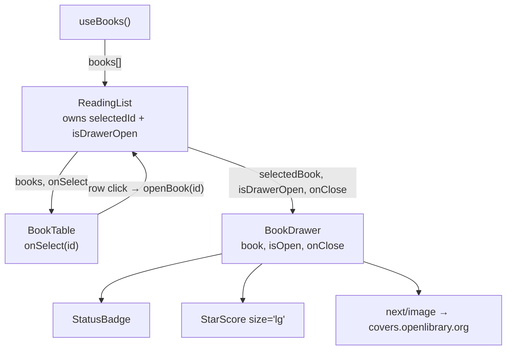

# 03 — Book Detail Drawer: View Only

> How it actually works, read off the diff.
> Spec: [context/features/03-book-detail-drawer.md](../features/03-book-detail-drawer.md)
> Commits: `fba1045` (implementation) → merged in `d834ba8`
> Base for the diff: `93dcbb4`

---

## 1. What this feature does, in plain language

Feature 02 left the table rendering six books with `hover:bg-stone-50` on each
row — an affordance pointing at something that didn't exist yet. This feature
is that something.

Click any row and a white panel slides in from the right over a dimmed
backdrop, showing that book's cover, title, type, author, Open Library link,
score as stars, and its status as a coloured pill. Close it with the `×` at the
top of the panel or by clicking anywhere on the dimmed area behind it. Click a
different row while it's open and the panel stays put while its contents swap.

Everything in the panel is **read-only**. The status pill is the same static
`StatusBadge` the table uses, not a dropdown; there's no delete button. That's
deliberate and stated in the spec's Notes — editing is feature 04, deleting is
feature 05. This feature exists to get the open/close mechanics right in
isolation, before anything in the panel can mutate data.

Below 768px the panel stops being a panel and becomes a full-screen overlay.

---

## 2. Files, and the job each one does

Small feature: one new component, three touched, one config change.

### New file

| File | Role |
| ---- | ---- |
| [src/components/books/BookDrawer.tsx](../../src/components/books/BookDrawer.tsx) | The whole drawer — backdrop, sliding panel, and the book's details laid out inside it. 124 lines, entirely presentational: it receives a book and two callbacks and owns no state. |

### Changed files

| File | Change |
| ---- | ------ |
| [src/components/books/ReadingList.tsx](../../src/components/books/ReadingList.tsx) | Gained the two pieces of state that drive the drawer, and now renders `<BookDrawer />` as a sibling of the table body. |
| [src/components/books/BookTable.tsx](../../src/components/books/BookTable.tsx) | Rows became clickable: new `onSelect` prop, a `cursor-pointer` row, a keyboard-reachable title button, and a `stopPropagation` on the link. |
| [src/components/books/StarScore.tsx](../../src/components/books/StarScore.tsx) | Gained an optional `size` prop (`"sm"` default, `"lg"` for the drawer). |
| [next.config.ts](../../next.config.ts) | Allow-listed `covers.openlibrary.org` so `next/image` will serve the cover. |
| `context/current-feature.md`, `context/project-overview.md` | Workflow bookkeeping and a rewritten design-reference policy. Not code — see §5. |

Note what *didn't* change: `src/lib/json-server.ts`, `src/hooks/useBooks.ts`,
`src/types/book.ts`, `globals.css`. No new data is fetched and no new field is
needed — `coverUrl` was already on the `Book` type from feature 02, carried
there precisely for this screen.

---

## 3. How the pieces connect



`ReadingList` is the only component holding state. The table reports a click
upward; the drawer receives a book downward. Neither knows the other exists.

### 3.1 The state design in `ReadingList` — two variables, not one

This is the single most deliberate decision in the feature, and the commit
message leads with it:

```tsx
const [selectedId, setSelectedId] = useState<string | null>(null);
const [isDrawerOpen, setIsDrawerOpen] = useState(false);

const selectedBook = books.find((book) => book.id === selectedId) ?? null;

function openBook(id: string) {
  setSelectedId(id);
  setIsDrawerOpen(true);
}
```

The obvious implementation is one variable: `selectedBook: Book | null`, where
`null` means closed. That fails in two separate ways here.

**Why "which book" and "is it open" are separate state.**
Closing sets `isDrawerOpen` to `false` and leaves `selectedId` alone. If a
single `null` meant closed, then at the instant you clicked ×, the book would
vanish and the panel would have nothing to render — you'd watch an empty white
rectangle slide out. Keeping the selection alive means the panel still has its
content for the 300ms it takes to leave the screen. The stale `selectedId`
after close is harmless: nothing is visible, and the next `openBook` overwrites
it.

**Why an id and not the `Book` object.**
Storing the object would freeze a snapshot taken at click time. `books.find(…)`
re-derives the book from the live array on every render instead. That does
nothing today, since nothing mutates books yet — but feature 04 will PATCH a
status and feature 05 will DELETE. When `useBooks`'s array updates, a stored
object would keep showing the old status while the table behind it showed the
new one. The lookup means the drawer can't drift.

The lookup is `O(n)` on every render against a six-book array. Not worth a
`Map`.

Note also *where* `<BookDrawer />` sits: outside the `body` branch, always
rendered, after `{body}`. It isn't part of the loading/error/empty/table
decision — it's a fixed-position overlay that renders itself as invisible when
closed (see below).

### 3.2 `BookDrawer` — always mounted, never conditionally rendered

The whole component returns a `fixed inset-0` div **unconditionally**. It is on
the page from the first paint, on top of everything, always.

```tsx
<div
  inert={!isOpen}
  className={`fixed inset-0 z-40 ${isOpen ? "" : "pointer-events-none"}`}
>
```

The reason is in the file's own comment: *"mounting it on open would leave it
already in place with nothing to animate from."* A CSS `transition` only fires
when a property **changes** on an element that's already in the DOM. If the
panel were mounted by `{isOpen && <Drawer/>}`, it would appear in its final
position on its very first frame — there'd be no `translate-x-full` → `0`
transition, because the browser never saw `translate-x-full`. Same problem in
reverse on close: unmounting removes the element instantly, so the exit
animation never runs.

Keeping it mounted and toggling classes gives CSS two states to interpolate
between, in both directions. The cost is an always-present full-screen element,
which is neutralised three ways:

| Concern | Handling |
| ------- | -------- |
| Invisible overlay swallowing clicks on the table | `pointer-events-none` on the container when closed |
| Panel off-screen but still tabbable | `inert={!isOpen}` — removes the whole subtree from the tab order and the accessibility tree |
| Panel visible past the right edge | `translate-x-full` puts it exactly its own width off-screen; the container is `fixed`, so no page scroll is created |

`inert` as a plain JSX boolean attribute is React 19 (`react: 19.2.4` here) —
in React 18 it had to be written `inert=""` to render at all.

**The backdrop is a `<button>`, not a `<div onClick>`.** Same visual result, but
a div with a click handler is invisible to keyboard and screen-reader users and
trips the `jsx-a11y` lint rules that `eslint-config-next` turns on. Making it a
real button gets it focusability and `aria-label="Close book details"` for free.
`cursor-default` cancels the pointer cursor a button would otherwise show,
since it should read as backdrop, not as a control.

**Two different transitions.** The backdrop fades (`transition-opacity`, 250ms,
`ease-out`); the panel slides (`transition-transform`, 300ms, a
`cubic-bezier(.4,0,.2,1)` ease). Separate properties, separate durations —
transforming or fading them together would look mechanical. Both are transforms
and opacity only, which the compositor handles without re-laying out the page —
which is what satisfies the spec's "no layout shift in the table behind it."

**Dialog semantics.** `role="dialog"`, `aria-modal="true"`, and
`aria-labelledby="book-drawer-title"` pointing at the `<h2>`, so a screen reader
announces the panel by the book's title.

### 3.3 The cover image, and the placeholder underneath it

```tsx
const COVER_PLACEHOLDER =
  "bg-[repeating-linear-gradient(135deg,#e7e5e4,#e7e5e4_8px,#f5f5f4_8px,#f5f5f4_16px)]";
```

The cover block is three layers stacked in one `relative` box:

1. The box itself carries a diagonal grey stripe pattern as its background.
2. A `<span>` centred over it reading `cover` in mono type.
3. `<Image fill className="object-cover">` on top, covering both.

Layers 1 and 2 come straight from the design file's placeholder treatment. They
aren't dead weight — they're the fallback. If Open Library is slow, or the
`coverUrl` 404s, the image simply doesn't paint and the striped placeholder is
what remains visible, rather than a broken-image frame. No `onError` handler and
no state needed; it's a pure z-ordering trick.

`aspect-[2/3] w-[150px]` fixes the box's size before the image loads, so the
panel's content doesn't jump when it arrives.

### 3.4 `next.config.ts` — why the config change was mandatory

```ts
images: {
  remotePatterns: [
    { protocol: "https", hostname: "covers.openlibrary.org", pathname: "/b/id/**" },
  ],
},
```

`next/image` refuses to optimise a remote host that isn't allow-listed — it
throws at runtime rather than silently proxying, because the optimiser would
otherwise be an open image proxy anyone could point at any URL. This is the
first feature to render a remote image, so it's the first to need the entry.

The `pathname: "/b/id/**"` narrows it further than the hostname alone would:
only the cover-by-id path is permitted, matching the URL shape documented in
[project-overview.md](../project-overview.md).

The alternative — a plain `` — would have skipped the config entirely, but
also skipped the automatic resizing and format conversion, and `eslint-config-next`
warns on bare ``.

### 3.5 `BookTable` — making a row clickable without breaking it

Three coordinated edits, each fixing a problem the first one creates:

```tsx
<tr onClick={() => onSelect(book.id)} className="cursor-pointer …">
```

**1. The row handler.** Click anywhere in the row, drawer opens. `cursor-pointer`
makes that discoverable.

**2. The title became a `<button>`.** A `<tr>` with `onClick` is mouse-only — you
can't tab to a table row. Rather than pile `tabIndex`, `role="button"` and an
`onKeyDown` onto the `<tr>` (which is what the a11y lint rule would otherwise
demand), the title cell now holds a real button carrying the same
`onSelect(book.id)`. Keyboard users tab to the title and press Enter; pointer
users can still click anywhere. The file says exactly this in a comment. The
click bubbles from the button up to the row's handler too — firing `onSelect`
twice with the same id, which is harmless since both calls set identical state.

**3. `stopPropagation` on the Open Library link.** Without it, clicking the link
in the last column would bubble to the row handler and open the drawer *and*
open a new tab — two unrelated things from one click.

```tsx
<a href={book.link} target="_blank" rel="noreferrer"
   onClick={(event) => event.stopPropagation()} …>
```

This is the classic hazard of whole-row click targets, and it's the only nested
interactive element in the row that needed it. (The title button doesn't, since
its action is the same as the row's.)

### 3.6 `StarScore` — the smallest possible size prop

```tsx
const SIZE_CLASSES: Record<NonNullable<StarScoreProps["size"]>, string> = {
  sm: "text-sm",
  lg: "text-[17px]",
};

export default function StarScore({ score, size = "sm" }: StarScoreProps) {
```

The design draws stars at 14px in the table and 17px in the drawer. Rather than
accept an arbitrary `className` or a pixel number, the prop is a two-value union
with a default — so every existing `<StarScore score={…} />` call in `BookTable`
kept working untouched, and there are exactly two star sizes in the app by
construction.

`Record<NonNullable<StarScoreProps["size"]>, string>` derives the map's keys from
the prop type instead of restating `"sm" | "lg"`. Add a `"md"` to the prop and
the map fails to compile until it's handled — the same exhaustiveness pattern
`StatusBadge` uses for `BookStatus`.

The literal `text-[17px]` matters for Tailwind: classes must appear as complete
strings in the source for the scanner to find them. Building the class as
`` `text-[${size}px]` `` would produce nothing at all in the stylesheet.

---

## 4. Spec vs. what shipped

| Spec requirement | Status |
| ---------------- | ------ |
| Row click opens a right-hand drawer with a backdrop | Built |
| Shows cover, title, author, link, score, static status badge | Built — plus `type` under the title, from the design |
| Closes via close button and via backdrop click | Built — bare `×`, and the backdrop is itself a button |
| One drawer at a time; clicking another row swaps content | Built — a single mounted drawer reading one `selectedId` |
| Opens/closes smoothly, no layout shift behind | Met — `fixed` overlay, transform/opacity only |
| Correct book for the clicked row | Met — id lookup against live `books` |
| Responsive per `project-overview.md` | Met — `w-full` below `md`, `md:w-[400px]` above |
| Status not editable (feature 04) | Held — `StatusBadge`, not a `<select>` |
| No delete button (feature 05) | Held |

**Added beyond the spec:** the `type` line under the title, the striped cover
placeholder, `size="lg"` on `StarScore`, the `next/image` host allow-list, and
the keyboard-reachable title button. Every one of these is either the design
file's own layout or a consequence of implementing it.

### Deviations from the design file, all recorded in the commit

These were written down in `context/current-feature.md` while the feature was in
progress, per the policy this feature introduced:

| Design shows | Built instead | Why |
| ------------ | ------------- | --- |
| Status `<select>` | Static `StatusBadge` | Feature 04 owns editing |
| Delete button | Nothing | Feature 05 owns it |
| Notes / Added / Finished fields | Nothing | The `Book` model has no such fields, and no later feature adds them |
| `max-width: 92vw` on mobile | Full-screen (`w-full`) | The acceptance criteria point at `project-overview.md`, which specifies full-screen below 768px |

### What went wrong, and what it changed

The commit message and the in-progress notes are unusually candid here: the
drawer was **first built by extrapolating from feature 02's table styling**, not
from the design file. That produced a bordered header instead of the design's
centred cover-and-title stack, the wrong field order, and a 400px panel where
the first pass had guessed 440px. It was re-laid out against
`Reading List.dc.html` before the commit landed.

The fix wasn't only to the component. [project-overview.md](../project-overview.md)
was rewritten in the same commit, from:

> "This is a design reference, not implementation code — use it for layout,
> spacing, and visual details when building the matching UI."

to:

> "This is **the source of truth for every UI feature**. Match it strictly …
> and **read it before building the component, not after**. Do not approximate
> a screen from already-built components."

Plus a new rule that deviations must be recorded, and a practical note that
`DesignSync`'s `list_files` / `get_file` reach the same project when the
claude-design import tools aren't loaded in a session. A process failure got
fixed at the process level rather than just patched in the one component.

### Known gaps

Two things a "modal dialog" usually has that this one doesn't, neither required
by the spec:

- **No Escape-key close.** The spec listed exactly two close affordances (button
  and backdrop) and both work.
- **No focus trap or focus restore.** `aria-modal="true"` tells assistive tech
  the rest of the page is inert, but nothing moves focus into the panel on open
  or back to the row on close. `inert={!isOpen}` handles the inverse problem
  (the closed panel isn't tabbable), which is the one that would actually break
  the table.

---

## 5. Where this sits in the sequence

**Depends on feature 02.** Everything it needed was already in place: the
clickable-looking rows, `StatusBadge` and `StarScore` to reuse, and `coverUrl`
on the `Book` type — a field feature 02 carried without rendering, specifically
for this screen. The only new component in the whole feature is the drawer
itself.

**Sets up feature 04 (status editing).** The drawer is now the place where a
book's status is displayed, which is where the spec says it becomes editable.
The `selectedId` + live-lookup design is what makes that work without extra
plumbing: when feature 04 PATCHes a status and `useBooks` updates its array, the
open drawer re-derives `selectedBook` and re-renders with the new value
automatically. The `<StatusBadge>` in the Status `<dd>` is the single element
that gets swapped for a `<select>`, and `STATUS_STYLES` in `StatusBadge` already
holds the three human-readable labels that dropdown needs.

**Sets up feature 05 (delete).** The delete button goes in this panel, and
`onClose` is already wired for the drawer to close itself after a successful
delete. `useBooks` will need to expose a mutation or refetch — this feature
consumes the hook but doesn't extend it.

**Establishes the design-reference discipline** used by features 06–08. The
search view and card grid are considerably more visual than anything so far;
the rule that landed here — read the design file first, deviate only where a
feature spec overrides it, and record each deviation — was written because of
what went wrong in this feature.

---

## 6. If you want to browse this code as it existed then

Don't check out the commit — it would move your working branch. Use a separate
worktree:

```bash
git worktree add ../review-book-detail-drawer d834ba8
```

That gives you a full checkout in a sibling folder with your current branch
untouched. Remove it with `git worktree remove ../review-book-detail-drawer`
when you're done.
