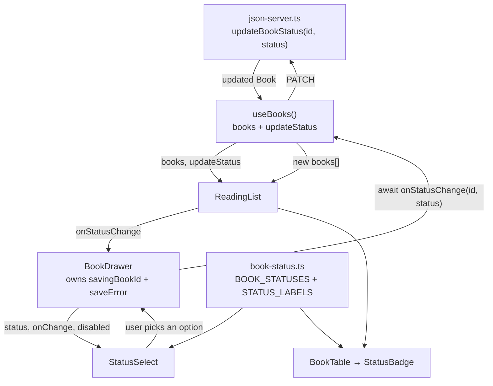

# 04 — Status Editing (Drawer)

> How it actually works, read off the diff.
> Spec: [context/features/04-status-editing.md](../features/04-status-editing.md)
> Commits: `76f9a25` (implementation) → merged in `51a89a1`
> Base for the diff: `f861c4f`

---

## 1. What this feature does, in plain language

Feature 03 put the book's status in the drawer as a coloured pill you could look
at and nothing else. This feature makes it the one thing on the page you can
change.

Open a book, pick a different status from the dropdown, and three things happen
in order: a `PATCH` goes to json-server, `db.json` on disk is rewritten, and the
status badge in the table behind the drawer recolours — no refetch, no reload.
If the request fails, a red line appears under the dropdown saying why, and the
dropdown snaps back to whatever is still stored.

This is the app's **first write**. Everything before it was `GET`. That's why a
feature this small — one dropdown — gets its own spec and its own commit: it
introduces the whole question of what happens when a write fails, and the answer
it settles on is the one feature 05 (delete) will reuse.

---

## 2. Files, and the job each one does

Two new files, four touched.

### New files

| File | Role |
| ---- | ---- |
| [src/components/books/StatusSelect.tsx](../../src/components/books/StatusSelect.tsx) | The dropdown. 36 lines, entirely presentational — takes a status, a change callback, and a `disabled` flag, and owns no state. |
| [src/lib/book-status.ts](../../src/lib/book-status.ts) | Two constants shared by the badge and the dropdown: `BOOK_STATUSES` (the design's option order) and `STATUS_LABELS` (`currently_reading` → "Currently Reading"). |

### Changed files

| File | Change |
| ---- | ------ |
| [src/lib/json-server.ts](../../src/lib/json-server.ts) | Gained `updateBookStatus` — the `PATCH` call. First non-`GET` function in the file. |
| [src/hooks/useBooks.ts](../../src/hooks/useBooks.ts) | Gained an `updateStatus` mutation and now returns four things instead of three. |
| [src/components/books/BookDrawer.tsx](../../src/components/books/BookDrawer.tsx) | Swapped `StatusBadge` for `StatusSelect`, and picked up the feature's only new state: what's saving, and what failed. |
| [src/components/books/ReadingList.tsx](../../src/components/books/ReadingList.tsx) | Two lines — pulls `updateStatus` off the hook and passes it down. |
| [src/components/books/StatusBadge.tsx](../../src/components/books/StatusBadge.tsx) | Labels moved out to `book-status.ts`; the colour tints stayed. Net 8 lines shorter. |

Note what *didn't* change: `src/types/book.ts`. `BookStatus` was already the
exact union of three literals this feature needs, written in feature 02. Nothing
about the data model moved.

---

## 3. How the pieces connect



The loop is the point: the change starts at the select, travels *up* through the
drawer to the hook, out to json-server, and the response comes back down a
different path — into the shared `books` array, which re-renders both the table's
badge and the drawer's dropdown at once. Nothing is updated in two places.

### 3.1 `updateBookStatus` — and why it returns the book

```ts
export async function updateBookStatus(
  id: string,
  status: BookStatus,
): Promise<Book> {
  let response: Response;

  try {
    response = await fetch(`${API_BASE_URL}/books/${id}`, {
      method: "PATCH",
      headers: { "Content-Type": "application/json" },
      body: JSON.stringify({ status }),
    });
  } catch {
    throw new Error(UNREACHABLE_MESSAGE);
  }

  if (!response.ok) {
    throw new Error(`Couldn't save the new status (${response.status}).`);
  }

  return (await response.json()) as Book;
}
```

It copies `getBooks`'s shape exactly — including the split between two kinds of
failure, which is the non-obvious part:

| Failure | Where it's caught | Message |
| ------- | ----------------- | ------- |
| json-server isn't running | the `try` around `fetch` | the shared `UNREACHABLE_MESSAGE` — "make sure json-server is running on port 3001" |
| json-server answered, but with 404/500 | the `!response.ok` check | `Couldn't save the new status (404).` |

`fetch` only rejects on a *network* failure. A 404 is a perfectly successful HTTP
round-trip as far as `fetch` is concerned, so `response.ok` has to be checked
separately or a missing book would sail through as a success. Reusing
`UNREACHABLE_MESSAGE` — a constant feature 01 put in this file — means the "start
your API server" hint is worded identically whether a read or a write hit it.

`PATCH` sends only `{ status }`, not the whole book. json-server merges it into
the stored record, so a partial body can't accidentally blank a field.

**Why return `Book` rather than `void`.** The comment above the function says it:

> Returns the book as json-server stored it, so the caller updates its local copy
> from the server's response rather than from what it hoped it wrote.

The caller could have patched its own state with the status it just sent. Reading
the response instead means local state can never disagree with the server, even
if the server transformed something on the way in. It's cheap — the response body
is already there — and it's the habit that keeps a UI honest.

### 3.2 `useBooks.updateStatus` — the deliberate decision *not* to store the error

```ts
// Rejects on failure rather than storing the error here: `error` above is the
// load failure that replaces the whole table, and a rejected save should not
// do that. The caller reports it next to the control the user just used.
const updateStatus = useCallback(async (id: string, status: BookStatus) => {
  const updated = await updateBookStatus(id, status);
  setBooks((current) =>
    current.map((book) => (book.id === id ? updated : book)),
  );
}, []);
```

This hook already has an `error` field. The obvious move is to reuse it — one
error slot, one error state. That would have been a bug, and the comment explains
why: look at how `ReadingList` consumes `error`.

```tsx
} else if (error) {
  body = <ErrorState message={error} />;   // replaces the entire table
```

`error` isn't "something went wrong", it's "there is no list to show". Routing a
failed save into it would delete the user's entire visible reading list off the
screen because one dropdown didn't save. So `updateStatus` doesn't catch at all —
it lets the rejection propagate to whoever called it, and that caller decides how
loud to be.

Two smaller things in four lines:

- **`useCallback` with `[]`.** The function closes over nothing but its arguments,
  so it never needs rebuilding, and a stable identity means passing it through
  `ReadingList` → `BookDrawer` doesn't invalidate anything downstream.
- **Functional `setBooks((current) => …)`.** Reads the array at apply time rather
  than at call time. Since an `await` sits between the click and this line, the
  captured `books` could be stale by the time it runs — the functional form can't
  be.

There's no optimistic update. The list only changes after the server confirms.
For a local json-server that's a few milliseconds, and it buys the property that
the UI never displays a status that isn't stored.

### 3.3 `BookDrawer` — why the state is keyed by book id

This is the subtlest thing in the feature. The drawer holds two pieces of state:

```tsx
interface SaveError {
  bookId: string;
  message: string;
}

const [savingBookId, setSavingBookId] = useState<string | null>(null);
const [saveError, setSaveError] = useState<SaveError | null>(null);
```

Both could have been simpler — `isSaving: boolean` and `saveError: string`. The
reason they aren't traces straight back to feature 03's architecture: **the drawer
is mounted permanently and only swaps its `book` prop.** It is never remounted, so
its state is never reset for you.

That creates a race. Consider:

1. You open book A and change its status. The `PATCH` is in flight.
2. You close the drawer and open book B.
3. The `PATCH` for A rejects.

With a plain string, step 3 writes A's error into state and book B — which had no
trouble at all — displays "Couldn't reach the book API". Tagging the error with
its book makes the render guard trivial:

```tsx
{saveError?.bookId === book.id && (
  <p role="alert" className="mt-2 …">{saveError.message}</p>
)}
```

A's late rejection is still stored, simply not shown while B is on screen. Same
reasoning for `savingBookId` over `isSaving` — otherwise B's dropdown would be
disabled because A's save hadn't come back.

The `finally` block carries the same care:

```tsx
} finally {
  setSavingBookId((current) => (current === id ? null : current));
}
```

Not `setSavingBookId(null)` — that would clear a *different* book's in-flight
marker if two saves somehow overlapped. Only clear the flag if it's still yours.

`role="alert"` on the error makes a screen reader announce it when it appears;
without it, a sighted-user-only error message would be silently added to the DOM.

### 3.4 `StatusSelect` — a controlled component with no state

```tsx
<select
  aria-label="Status"
  value={status}
  disabled={disabled}
  onChange={(event) => onChange(event.target.value as BookStatus)}
  className="w-full rounded-lg border border-stone-200 bg-white px-3 py-[9px] text-sm text-stone-900 disabled:cursor-wait disabled:opacity-60"
>
  {BOOK_STATUSES.map((option) => (
    <option key={option} value={option}>{STATUS_LABELS[option]}</option>
  ))}
</select>
```

`value={status}` with no local `useState` makes this fully controlled by the book
prop, and that single line is what produces the revert-on-failure behaviour.
Nobody wrote "reset the dropdown if the save fails" — the select renders
`book.status`, a failed save never changes `book.status`, so the next render puts
it back. The visual behaviour falls out of the data flow.

`value` and `option` carry the raw union members (`want_to_read`), while the text
comes from `STATUS_LABELS`. The stored value and the displayed label stay
separate, so the DB never sees a human-readable string.

**The `as BookStatus` cast.** `event.target.value` is typed `string` by the DOM —
TypeScript can't know a `<select>`'s value is limited to its own `<option>`s.
Since every option is generated from `BOOK_STATUSES`, no other value can reach
this line, which makes the assertion sound rather than hopeful. The alternative
(a runtime guard) would be checking something the component itself guarantees.

`disabled` is a **required** prop, not optional. Nothing forces that, but it means
a future caller can't quietly forget to pass it and get a dropdown that stays live
mid-save.

### 3.5 `book-status.ts` — and the tint that stayed behind

Feature 02 wrote this in `StatusBadge`, and its build-log entry says it was for
this feature:

```ts
const STATUS_STYLES: Record<BookStatus, { label: string; className: string }> = {
  read: { label: "Read", className: "bg-status-read/15 …" },
  …
};
```

One map, two concerns: labels and colours. The dropdown needs the labels but must
not have the colours, so the map was split rather than shared wholesale:

| Constant | Lives in | Used by |
| -------- | -------- | ------- |
| `STATUS_LABELS` | `src/lib/book-status.ts` | `StatusBadge` **and** `StatusSelect` |
| `BOOK_STATUSES` | `src/lib/book-status.ts` | `StatusSelect` (option order) |
| `STATUS_TINTS` | stayed in `StatusBadge.tsx` | `StatusBadge` only |

The tints could have moved too — they'd been in the shared file briefly — but a
constant with one consumer belongs next to that consumer. What went to `lib/` is
precisely what two files need.

`BOOK_STATUSES` exists because a `Record` has no reliable order to iterate for
rendering options, and because the order is a *design* decision, not a data one.
It's typed `readonly BookStatus[]`, so a status added to the union doesn't
automatically appear here — that's a real gap, noted in §4.

The comment in `StatusBadge` about Tailwind is worth keeping in mind:

> Tailwind only matches class names it can read as whole strings, so these stay
> literal rather than being built from the status.

`` `bg-status-${status}/15` `` would compile fine and produce no CSS whatsoever —
Tailwind's scanner reads source text, it doesn't run your code.

---

## 4. Spec vs. what shipped

| Spec requirement | Status |
| ---------------- | ------ |
| Status becomes a dropdown with the three options | Built — `StatusSelect` |
| `PATCH /books/:id` on change | Built — `updateBookStatus` |
| Table's badge updates after a successful PATCH | Built — via local state update, not a refetch |
| Failed PATCH shows a visible error | Built — `role="alert"` under the control |
| **AC:** change updates `db.json`, verified directly | Verified — read off disk, not just the API |
| **AC:** table updates without a page reload | Verified |
| **AC:** simulated failure shows an error, not a blank/frozen UI | Verified — `fetch` stubbed to reject PATCHes; drawer stayed interactive and a later save succeeded |

The spec offered "either via refetch or local state update" for the table. Local
update won: a refetch would re-`GET` six books to learn one field that the `PATCH`
response already contained.

### Added beyond the spec

- **Disabled-while-saving** on the select. The spec doesn't ask for it; it's what
  stops a second `PATCH` firing before the first returns.
- **`aria-label="Status"`** — the visible `<dt>Status</dt>` is a description-list
  term, not a `<label>`, so it doesn't name the control for assistive tech.

### Deviations from the design file

| Design shows | Built instead | Why |
| ------------ | ------------- | --- |
| A synchronous `<select>` | Adds `disabled:cursor-wait disabled:opacity-60` | The design has no notion of a save in flight |
| No error state | Error message under the select | The spec requires a visible failure state |
| Added / Finished dates, Notes textarea | Nothing | No such fields on the `Book` model — same call feature 03 made |
| Delete Book button | Nothing | Feature 05 owns it |

### What went wrong, and what it changed

The same mistake as feature 03, one feature later. `StatusSelect` was **first
built as a coloured pill** — `rounded-full`, the status tint reused from
`StatusBadge`, `appearance-none` with a hand-drawn `▼` caret, 12px semibold text,
sized to its content. The reasoning was that the drawer had shown status as a
pill in feature 03 and dropping the colour would be a regression.

The design says otherwise, and had said so all along:

```html
<select style="width:100%;box-sizing:border-box;padding:9px 12px;border-radius:8px;
               border:1px solid {{ border }};font-size:14px;color:{{ ink }};background:#fff;">
  <option>Want to Read</option><option>Currently Reading</option><option>Read</option>
</select>
```

A plain full-width white box with the platform's own chrome — deliberately *not*
the pill, because the drawer's status is a form control and the table's is a
read-only label. Every dimension of the guess was wrong, including the option
order, which the first pass had reversed.

The cause was procedural rather than aesthetic. The claude-design MCP server
returned a consent error on every read, and instead of stopping, the work
continued with the design recorded as an open deviation to check later. Feature
03 had already established the file as the strict source of truth to be read
*before* building. Once `/design consent` was granted the file was read and the
control rebuilt from it, and the rule was sharpened: an unreadable design is a
blocker to wait on, not a deviation to log.

### Known gaps

- **A failed save's error survives a close/reopen of the same book.** It clears on
  the next attempt, not on close. The message is still true — that change really
  didn't save — and the select shows the stored value, so it misinforms nobody.
- **`BOOK_STATUSES` isn't exhaustive by construction.** A fourth `BookStatus`
  would compile everywhere and silently never appear in the dropdown, because a
  `readonly BookStatus[]` doesn't have to list every member the way
  `Record<BookStatus, …>` does. `STATUS_LABELS` next to it *would* fail to
  compile, so the gap is narrow.
- **No pending indicator beyond the disabled styling.** Against localhost the
  window is a few milliseconds.

---

## 5. Where this sits in the sequence

**Depends on feature 03**, and consumes the two decisions it made specifically for
this one. `ReadingList` stores `selectedId` and re-derives the book with
`books.find` on every render, so when `updateStatus` replaces an entry in the
array the open drawer picks up the new status with no extra wiring — that lookup
existed for exactly this moment. Feature 03's build log predicted the change too:
*"the `<StatusBadge>` in the Status `<dd>` is the single element that gets swapped
for a `<select>`."* That's what happened, one line.

**Sets the pattern for feature 05 (delete).** Delete is the same shape one verb
over: a `deleteBook` in `json-server.ts` mirroring `updateBookStatus`, a mutation
on `useBooks` that rejects rather than swallowing, and the drawer catching it. Two
things will differ — `DELETE` has no useful response body to fold into state, so
it removes by id instead; and it needs the confirmation step
`coding-standards.md` requires before any destructive call.

**Completes the drawer's write surface with 05.** After both, the drawer is the
only place in the app that mutates data, and `useBooks` is the only thing that
talks to json-server.

**Feature 07 (add to list)** will add the third verb, `POST`, and will reuse
`STATUS_LABELS` / `BOOK_STATUSES` — it defaults new books to `want_to_read`, which
is already the first entry in the design's option order.

---

## 6. If you want to browse this code as it existed then

Don't check out the commit — it would move your working branch. Use a separate
worktree:

```bash
git worktree add ../review-status-editing 51a89a1
```

That gives you a full checkout in a sibling folder with your current branch
untouched. Remove it with `git worktree remove ../review-status-editing` when
you're done.

To see the pill-versus-box rework specifically, the design file is the reference:
`Reading List.dc.html` in Claude Design project `529c3d37-dc74-4ef9-8d5a-e758ce3e5835`,
readable via the claude-design MCP once `/design consent` has been granted.
