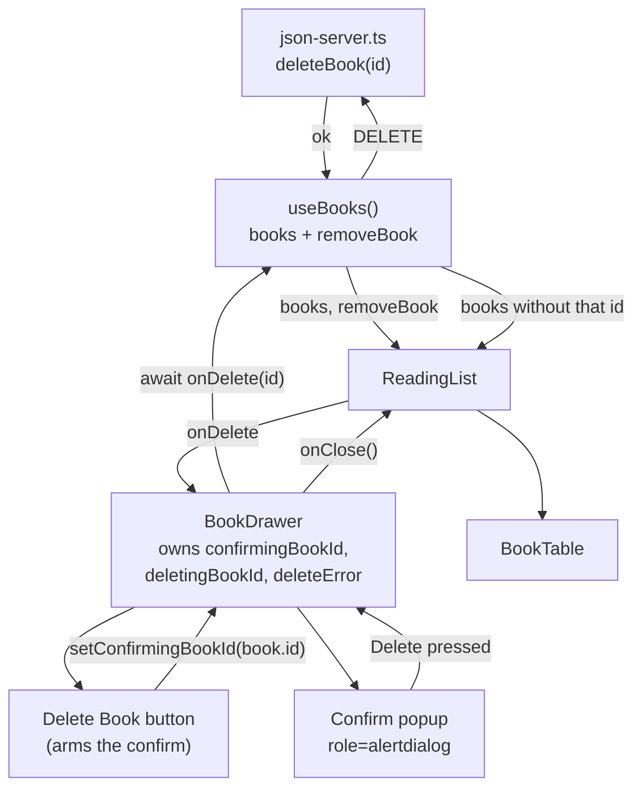

# 05 — Delete Flow (Drawer)

> How it actually works, read off the diff.
> Spec: [context/features/05-delete-flow.md](../features/05-delete-flow.md)
> Commits: `70bf420` (implementation) → merged in `621bbcb`
> Base for the diff: `137f569`
> Follow-up: `e272b67` added one clarifying comment to `handleDelete`.

---

## 1. What this feature does, in plain language

Open a book, scroll to the bottom of the drawer, and there is a red-outlined
**Delete Book** button. Clicking it does not delete anything. It raises a card in
the middle of the drawer — "Delete this book?" — with the fields behind it dimmed
and blurred, and two buttons: Cancel and Delete.

Cancel puts everything back. Delete sends `DELETE /books/:id`, and on success the
row vanishes from the table, the book is gone from `db.json`, and the drawer
slides shut on its own. If the request fails, a red line appears inside the card,
the card stays open, and nothing was removed.

This is the app's **first destructive write**, and the reason it got its own spec
and its own commit rather than riding along with feature 04. The mechanics are
smaller than status editing — one verb, no new files — but the question it
answers is different: not "how do we save?" but "how do we make sure the user
meant it?"

---

## 2. Files, and the job each one does

**No new files.** Feature 04 added two; this one adds none. Every piece had a
place to go already, which is itself the story of the feature — the shapes laid
down in 02, 03 and 04 turned out to be the right ones.

| File | Change |
| ---- | ------ |
| [src/lib/json-server.ts](../../src/lib/json-server.ts) | Gained `deleteBook` — the third verb, +16 lines. |
| [src/hooks/useBooks.ts](../../src/hooks/useBooks.ts) | Gained a `removeBook` mutation; the hook now returns five things. |
| [src/components/books/BookDrawer.tsx](../../src/components/books/BookDrawer.tsx) | Everything else, +130 lines: the button, the popup, three new pieces of state, and a wrapper around closing. |
| [src/components/books/ReadingList.tsx](../../src/components/books/ReadingList.tsx) | Two lines — pulls `removeBook` off the hook and passes it down, exactly as it did for `updateStatus`. |

`src/types/book.ts` is untouched again. Deleting a book needs no new shape.

---

## 3. How the pieces connect



Compare this with feature 04's diagram and the difference is the loop at the top:
the button doesn't call the hook, it arms a piece of local state, and only the
popup can reach `onDelete`. That gap between "clicked delete" and "deleted" *is*
the feature.

### 3.1 `deleteBook` — the verb with nothing to bring back

```ts
// The response body is ignored — json-server echoes the deleted record, and
// there is nothing left to update a local copy from.
export async function deleteBook(id: string): Promise<void> {
  let response: Response;

  try {
    response = await fetch(`${API_BASE_URL}/books/${id}`, { method: "DELETE" });
  } catch {
    throw new Error(UNREACHABLE_MESSAGE);
  }

  if (!response.ok) {
    throw new Error(`Couldn't delete this book (${response.status}).`);
  }
}
```

Structurally identical to `updateBookStatus` — the same two-kinds-of-failure
split, the same shared `UNREACHABLE_MESSAGE` for a dead server, the same
`response.ok` check because `fetch` treats a 404 as a successful round trip.

The one difference is the return type. `updateBookStatus` returns `Book` so the
caller can fold the server's version into local state; that reasoning doesn't
survive a delete. json-server does echo the deleted record, but there is no local
copy left to correct, so reading the body would be ceremony. `Promise<void>`, and
the comment says why so the asymmetry doesn't read as an oversight.

### 3.2 `useBooks.removeBook` — subtraction instead of substitution

```ts
// Rejects on failure for the same reason as `updateStatus`. Dropping the book
// from local state is the table's refresh: the server is now the shorter list,
// so refetching it would only cost a round trip to learn that.
const removeBook = useCallback(async (id: string) => {
  await deleteBook(id);
  setBooks((current) => current.filter((book) => book.id !== id));
}, []);
```

Three inherited decisions, all from feature 04, all deliberate:

- **It rejects rather than setting the hook's `error`.** That field means "there
  is no list to show" and swaps the entire table for an error panel. A delete
  that failed leaves a perfectly valid list on screen, so blanking it would be
  the wrong response to the smaller problem.
- **`useCallback` with `[]`** — closes over nothing, stable identity all the way
  down to the drawer.
- **Functional `setBooks`** — an `await` sits between the click and this line, so
  reading the array at apply time is the only safe form.

The spec allowed "refresh the table" to mean a refetch. `filter` won for the same
reason feature 04 skipped one: a `GET` would re-fetch every remaining book to
discover the single fact we already have — that one id is gone.

### 3.3 `BookDrawer` — three ids and a guard

The drawer gained three state slots, and the shape of each is the interesting
part:

```tsx
const [confirmingBookId, setConfirmingBookId] = useState<string | null>(null);
const [deletingBookId, setDeletingBookId] = useState<string | null>(null);
const [deleteError, setDeleteError] = useState<SaveError | null>(null);

const isConfirming = book !== null && confirmingBookId === book.id;
```

All three are keyed by book id rather than being booleans or bare strings —
`deleteError` reuses the `SaveError` interface feature 04 wrote, which pairs a
message with the `bookId` it belongs to. The reason is the one feature 03 built
in and 04 first hit: **the drawer is mounted permanently and only swaps its `book`
prop**, so its state is never reset for you. A boolean `isConfirming` would mean
an armed delete could survive onto whatever book the drawer showed next.

`isConfirming` compares against the *current* book, so state left over from
another book is inert by construction rather than by cleanup.

**Closing disarms the confirm — except mid-request:**

```tsx
function handleClose() {
  if (deletingBookId !== null) return;
  setConfirmingBookId(null);
  onClose();
}
```

Closing the drawer is a "never mind", so reopening a book should never present an
already-armed delete. The guard on the first line is the subtle half: the failure
message renders *inside* the popup, so a close that landed mid-request would
disarm the confirm and take away the element the error was about to appear in.
Letting the request land first keeps the error somewhere to go.

Both close affordances — the bare `×` and the full-screen backdrop — were
repointed from `onClose` to `handleClose` so neither can bypass it.

**And the one place that deliberately doesn't use it:**

```tsx
try {
  await onDelete(id);
  // `onClose` and not `handleClose`: the id below is still set until the
  // `finally` runs, so going through the guard above would refuse the very
  // close this succeeded in earning.
  setConfirmingBookId(null);
  onClose();
} catch (caught) {
  setDeleteError({ bookId: id, message: … });
} finally {
  setDeletingBookId((current) => (current === id ? null : current));
}
```

`deletingBookId` is cleared in the `finally`, which runs *after* the `try` body.
So at the moment of success it is still set, and `handleClose()` would hit its own
guard and silently refuse. Calling `onClose` directly is correct, and the comment
(added in `e272b67` during self-review) exists because it reads like a slip.

The `finally` clears by id rather than unconditionally — the same late-rejection
defence feature 04 used for `savingBookId`.

### 3.4 The popup — why it is a sibling of the panel

```tsx
</aside>

{book && isConfirming && (
  <div className="absolute inset-y-0 right-0 flex w-full items-center justify-center p-6 md:w-[400px]">
```

The popup sits **outside** `<aside>`, as its sibling inside the same fixed
overlay, and repeats the panel's exact geometry (`inset-y-0 right-0`, full width
below `md`, 400px above). Two reasons, both structural:

- **The panel scrolls** (`overflow-y-auto`). An overlay nested inside it would be
  positioned against the scroll origin and would slide away from the very fields
  it exists to cover.
- **The dimming stays inside the drawer.** The table behind already has its own
  `bg-black/35` backdrop from feature 03; layering a second scrim over the whole
  viewport would double-darken it.

Inside, a full-bleed `<button>` carries the scrim and the dismiss, and the card
sits above it as a `relative` sibling — the same backdrop-as-a-button pattern
feature 03 used for closing the drawer.

```tsx
className="absolute inset-0 h-full w-full cursor-default bg-black/30 backdrop-blur-[3px]"
```

`bg-black/30` plus a 3px `backdrop-blur` — dimmed *and* softened, so the fields
read as pushed back rather than merely shaded, while the book's cover and title
stay recognisable behind the card.

The `book &&` in the guard is redundant with `isConfirming`, which already
requires a non-null book. It stays because TypeScript cannot narrow `book`
through a separately-declared boolean, and `book.title` is read inside.

**The panel goes inert while the popup is up:**

```tsx
inert={isConfirming}
```

Blurred, unreadable fields should not still be reachable by Tab. This is the same
`inert` technique the outer overlay already used to keep the closed drawer out of
the tab order — applied one level in.

### 3.5 The button — where the design still governs

```tsx
className={`mt-6 w-full rounded-lg border p-[11px] text-sm font-semibold ${DELETE_BORDER} ${DELETE_INK}`}
```

The design file draws this button precisely, and it was copied precisely:

| Design | Built |
| ------ | ----- |
| `padding:11px` | `p-[11px]` |
| `border-radius:8px` | `rounded-lg` |
| `font-size:14px; font-weight:600` | `text-sm font-semibold` |
| `background:none` | no background utility |
| `border:1px solid oklch(0.75 0.14 25)` | `DELETE_BORDER` |
| `color:oklch(0.5 0.16 25)` | `DELETE_INK` |
| full width, `margin-top:6px` under an 18px column gap | `w-full mt-6` |

That last row is the only translation with any thought in it. In the design the
button is the final child of the field column, so its top edge sits 18px (the
gap) plus 6px (its own margin) below the status field. Here it lives *outside* the
`<dl>` — a `<button>` is not valid as a direct child of a definition list — so the
same 24px is expressed as a single `mt-6`.

The two colours are module constants rather than `@theme` tokens because nothing
outside this control refers to them. The popup's filled Delete reuses the ink
value as a background (`bg-[oklch(0.5_0.16_25)]`), written out rather than shared,
since a Tailwind class has to be a static string for the compiler to see it.

---

## 4. Spec vs. what shipped

| Spec requirement | Status |
| ---------------- | ------ |
| Delete button in the drawer | Built — the design's own button |
| A confirmation step; delete never fires on one click | Built — `alertdialog` popup |
| `DELETE /books/:id` on confirm | Built — `deleteBook` |
| Close the drawer and refresh the table on success | Built — `onClose` + `filter`, no refetch |
| **AC:** clicking delete without confirming does nothing to the data | Verified — count unchanged at 5 after Cancel |
| **AC:** confirmed delete removes the book from `db.json` and the table | Verified — read off disk, not just the API |
| **AC:** drawer closes automatically after a successful delete | Verified |

Also checked: the popup at 390px, where the drawer is full-screen; and the
failure path, with `window.fetch` stubbed to reject `DELETE` — the error rendered
inside the card, the card stayed open, and the book survived.

### Added beyond the spec

- **A named book in the prompt.** The spec asks only for a confirmation step; the
  card names the title so a mis-clicked row is caught before it costs anything.
- **Disabled-while-deleting** on both popup buttons, with the confirm reading
  "Deleting…". Same reasoning as feature 04's disabled select.
- **`inert` on the panel** behind the popup.
- **The close guard** during an in-flight delete.

### Deviations from the design file

| Design shows | Built instead | Why |
| ------------ | ------------- | --- |
| One click deletes, no confirm UI at all | A confirmation popup | The spec explicitly overrides it — "the delete must never fire on a single click" |
| No error state | Error inside the popup | The spec requires a visible failure state |
| No in-flight state | Disabled buttons, "Deleting…" | The design has no notion of a request in flight |

The design's `onDelete` is literally
`setState(s => ({ books: filter(...), drawerBookId: null }))` — it removes and
closes in one gesture. That confirms the *outcome* the spec describes even as it
omits the confirmation, which is why the button and the post-delete behaviour
could be copied while only the middle step was invented.

Worth noting the design also empties its drawer on delete: `drawerBook` falls back
to a blank placeholder, so its panel slides out showing empty fields. Ours
unmounts the body entirely and slides out a plain white panel — the same
impression, reached more simply, so it was left alone.

### What changed during review

The confirmation was **first built inline**: the `Delete Book` button swapped in
place for a bordered box holding the prompt and the two buttons, in the same slot
at the foot of the field column. It worked and met the spec.

It was rebuilt as a centred popup on review — a destructive confirmation reads
better as something that interrupts than as something that appears in a list you
may have to scroll to. That change is what forced the sibling-not-child
positioning, the `inert`, and the scrim; the inline version needed none of them.
Nothing broke: this was a design call, not a defect.

### Known gaps

- **Focus is not moved into the popup, and not trapped there.** Applying `inert`
  to the panel blurs whatever was focused, so Tab enters the popup from the top
  of the document rather than landing on Cancel. The drawer itself has never
  trapped focus either, so this matches the existing pattern rather than opening
  a new hole — but it means neither is a true modal for a keyboard user.
- **No Escape-to-dismiss**, on the popup or the drawer. Also pre-existing.
- **Clicking the outer backdrop while the popup is open closes the whole
  drawer**, rather than just dismissing the confirm. Defensible — leaving is a
  "never mind" either way — but it is one gesture doing two jobs.
- **No undo.** `db.json` is the only copy, and `db:reset` restores the seed, not
  the deleted book. This is why the confirmation exists at all.
- **`deleteError` is never explicitly cleared on close.** It doesn't leak,
  because it only renders inside the popup and re-arming clears it first, so a
  stale message can't reach the screen.

---

## 5. Where this sits in the sequence

**Depends on feature 03**, which built the drawer, and inherits its two
structural decisions. `ReadingList` re-derives the book with `books.find` each
render, so when `removeBook` filters the array the drawer's `book` prop becomes
`null` with no extra wiring — that is what makes the panel empty itself on
delete. And the permanently-mounted drawer is why all three new state slots are
keyed by id.

**Follows the pattern feature 04 set**, almost line for line: a verb in
`json-server.ts`, a mutation on `useBooks` that rejects rather than swallowing,
and the drawer catching it and reporting beside the control. Feature 04's own
notes predicted both of this feature's departures from that template — that
`DELETE` would have no useful body to fold into state, and that it would need a
confirmation step first. Both held.

**Completes the drawer's write surface.** With 04 and 05 both in, the drawer is
the only place in the app that mutates data, and `useBooks` is the only thing
that talks to json-server. Nothing else in the codebase issues a write.

**Feature 07 (add to list)** adds the fourth and last verb, `POST`, from the
search view rather than the drawer — the first mutation that doesn't originate
here.

**Feature 08 (polish)** is the natural home for the focus gaps above, since they
belong to the drawer and the popup together rather than to either alone.

---

## 6. If you want to browse this code as it existed then

Don't check out the commit — it would move your working branch. Use a separate
worktree:

```bash
git worktree add ../review-delete-flow 621bbcb
```

That gives you a full checkout in a sibling folder with your current branch
untouched. Remove it with `git worktree remove ../review-delete-flow` when you're
done.

To see the inline-versus-popup rework, it isn't in git history — the inline
version was replaced before the commit, so `70bf420` contains only the popup. The
design's own delete button is in `Reading List.dc.html` in Claude Design project
`529c3d37-dc74-4ef9-8d5a-e758ce3e5835`, at the end of the drawer's field column.
