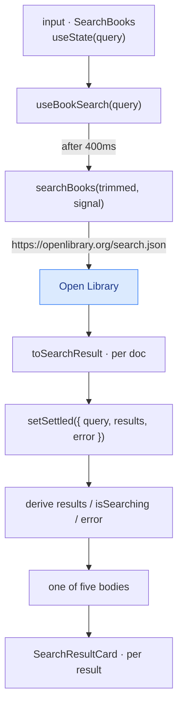
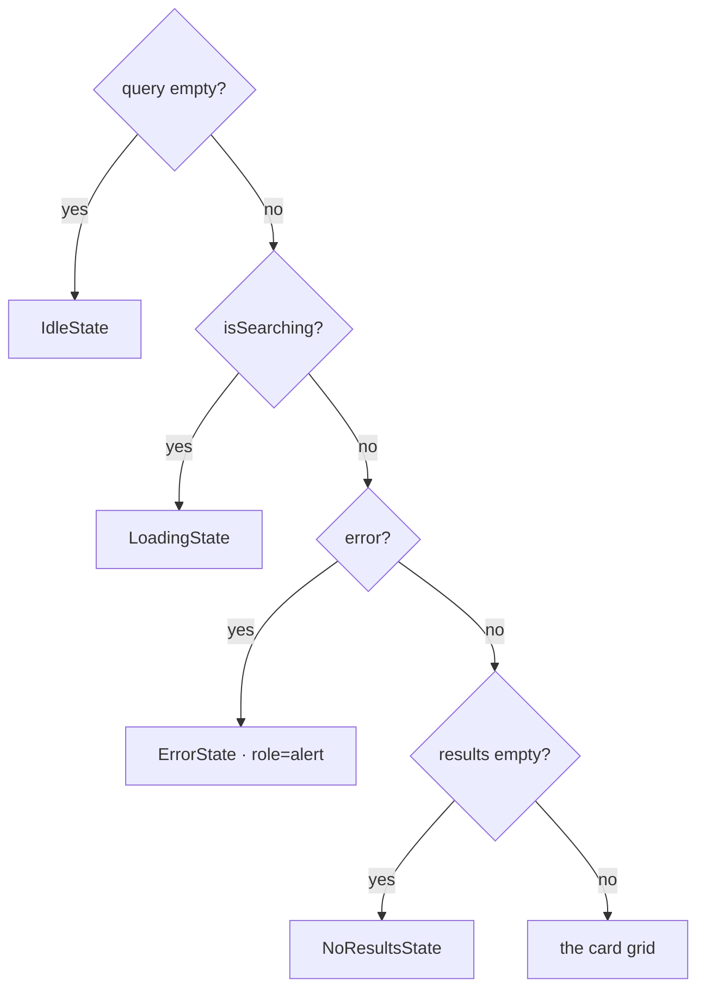

# 06 — Search View: Open Library Results

> How it actually works, read off the diff.
> Spec: [context/features/06-search-open-library.md](../features/06-search-open-library.md)
> Commits: `c335351` (implementation) → merged in `843b23b`
> Base for the diff: `9f8ce76`
> Follow-up: `b916280` reworked the live region and unexported `buildCoverUrl`.

---

## 1. What this feature does, in plain language

Click **+ Add Book** on the reading list and the app switches to a dark screen
called "Add a Book". There is one input. Type into it and, about half a second
after you stop, a grid of book cards appears — cover, title, author, and a row of
stars — pulled live from Open Library.

Nothing on this screen writes anything. There is no Add button yet; that is
feature 07. This feature is only about the round trip: take what someone typed,
ask Open Library, and render the answer — including the three answers that are
not a list of books. Type nothing and you get an invitation. Type nonsense and
you get "No books found". Lose your connection and you get a red panel that tells
you so, and that keeps working once the connection comes back.

It is the app's **first read from a service it does not control**. Everything
before it talked to `json-server` on localhost, which is always up, always fast,
and always returns exactly the shape `db.json` was hand-written to have. Open
Library is none of those things — it is slow enough that loading is a real state,
it omits fields whenever it feels like it, and it can simply fail. Most of what is
interesting in this diff is a consequence of that.

---

## 2. Files, and the job each one does

Five new files, four touched. The new ones stack into a straight line — types
under a fetch helper, a fetch helper under a hook, a hook under two components.

| File | Change |
| ---- | ------ |
| [src/types/open-library.ts](../../src/types/open-library.ts) | **New.** Two interfaces describing Open Library's response, and one describing what a card needs. |
| [src/lib/open-library.ts](../../src/lib/open-library.ts) | **New.** `searchBooks` — builds the URL, fetches, converts each result into card shape. |
| [src/hooks/useBookSearch.ts](../../src/hooks/useBookSearch.ts) | **New.** Turns a live input value into `{ results, isSearching, error }`. Owns the debounce and the cancellation. |
| [src/components/search/SearchBooks.tsx](../../src/components/search/SearchBooks.tsx) | **New.** The screen: back link, heading, input, and whichever of five bodies applies. |
| [src/components/search/SearchResultCard.tsx](../../src/components/search/SearchResultCard.tsx) | **New.** One card. |
| [src/app/search/page.tsx](../../src/app/search/page.tsx) | **New.** The `/search` route — eleven lines of dark shell around `SearchBooks`. |
| [src/app/globals.css](../../src/app/globals.css) | Five `@theme` tokens for the dark palette. |
| [src/components/books/StarScore.tsx](../../src/components/books/StarScore.tsx) | Gained a `size` option and a `tone` prop, so one star row serves both themes. |
| [src/components/books/ReadingList.tsx](../../src/components/books/ReadingList.tsx) | The `+ Add Book` link, in the header and the empty state. |

Note what is *not* here. `src/types/book.ts` is untouched — a search result is not
a `Book` and does not pretend to be one. `src/lib/json-server.ts` is untouched —
this feature never talks to the local API. `useBooks` is untouched. The reading
list and the search view share no data at all yet, which is exactly the seam
feature 07 has to close.

---

## 3. How the pieces connect



### 3.1 The request, and the two query parameters the spec didn't ask for

The spec says to call `GET https://openlibrary.org/search.json?q={query}`. The
built URL is [open-library.ts:29](../../src/lib/open-library.ts#L29):

```ts
const url = `${SEARCH_URL}?q=${encodeURIComponent(query)}&fields=${SEARCH_FIELDS}&limit=${RESULT_LIMIT}`;
```

`fields` is there because of a fact you can only discover by calling the API: the
default response **does not include `ratings_average`**. It returns two dozen
other things — `ebook_access`, `ia_collection`, `lending_edition_s` — but not the
rating. The spec asks for a star rating on every card, so the fields have to be
named explicitly to get one. Naming them also shrinks the payload to the five
things a card actually renders.

`limit` is there because the API pages at 100. Without it, one keystroke's worth
of typing fetches a hundred results and asks `next/image` to optimise a hundred
covers, for a grid nobody scrolls to the bottom of. 24 is four rows.

### 3.2 Every field is optional, and the type says so

[open-library.ts:5-11](../../src/types/open-library.ts#L5-L11) declares only `key`
and `title` as required:

```ts
export interface OpenLibraryDoc {
  key: string;
  title: string;
  author_name?: string[];
  cover_i?: number;
  ratings_average?: number;
}
```

This is not defensive typing for its own sake — it is what the API does. A work
with no scanned cover has no `cover_i`. An uncredited work has no `author_name`.
A work nobody has rated has no `ratings_average`. Because the type marks them
optional, TypeScript forces `toSearchResult` to decide what each absence means,
and it decides three different things
([open-library.ts:53-67](../../src/lib/open-library.ts#L53-L67), `toSearchResult`):

| Missing | Becomes | Why that and not something else |
| ------- | ------- | ------------------------------- |
| `author_name` | `"Unknown author"` | The card has a line for it; leaving it blank looks like a rendering bug. |
| `cover_i` | `coverUrl: null` | Not a URL that 404s. The card branches on `null` and shows the striped placeholder — a deliberate frame rather than a broken image. |
| `ratings_average` | `0` | Which renders as five empty stars, correctly meaning "nobody has rated this". |

Two details in that function worth pausing on. First, `cover_i` is tested with
`=== undefined` rather than for falsiness — a subtle distinction that costs
nothing and means a hypothetical id of `0` would still build a URL. Second,
`author_name?.[0]` takes **only the first name**. Open Library credits everyone in
that array: search "Pride and Prejudice" and one result lists Seth Grahame-Smith,
Jane Austen *and* the audiobook narrator. Joining them would wrap the card's
one-line author field to three.

### 3.3 `useBookSearch`, and why it stores one object instead of three

This is the most interesting file in the diff, and it does not look like the
obvious version of itself. The obvious version holds three pieces of state —
`results`, `isSearching`, `error` — and sets each as things happen. That version
was written first, and lint rejected it: React's `set-state-in-effect` rule fired
on the branch that cleared everything when the query went empty.

What replaced it holds **one** piece of state, and it carries the query it belongs
to ([useBookSearch.ts:22-26](../../src/hooks/useBookSearch.ts#L22-L26)):

```ts
interface Settled {
  query: string;
  results: SearchResult[];
  error: string | null;
}
```

Everything the hook returns is then derived from a single comparison
([useBookSearch.ts:71-77](../../src/hooks/useBookSearch.ts#L71-L77)):

```ts
const isSettled = settled.query === trimmed;

return {
  results: isSettled ? settled.results : [],
  isSearching: trimmed !== "" && !isSettled,
  error: isSettled ? settled.error : null,
};
```

Read that as a sentence: *results are only shown while they still answer what is
in the box.* Three behaviours fall out of it for free, none of which had to be
written:

- **Stale results can't leak.** The moment you type another character, `trimmed`
  changes, `isSettled` goes false, and the previous query's results are withheld
  — not because anything cleared them, but because they no longer match.
- **The debounce reads as loading.** During those 400ms no request has even been
  sent, but `isSearching` is already true, because a non-empty query with no
  matching answer *is* pending. The obvious version had to remember to set a flag
  early; this one cannot forget.
- **Clearing the box returns to idle.** `trimmed` becomes `""`, which matches
  nothing, so results and error are withheld and `isSearching` is false by its
  first clause. No cleanup code, and no `setState` in an effect body.

The effect itself now only ever sets state from **inside** a timeout callback,
which is what satisfies the lint rule — but the version that satisfies it is also
simply the better one, which is worth noticing as a pattern rather than a
coincidence.

### 3.4 Two guards against a superseded search

Typing "dune" is four renders and up to four requests. The cleanup at
[useBookSearch.ts:61-64](../../src/hooks/useBookSearch.ts#L61-L64) handles both
halves of that:

```ts
return () => {
  clearTimeout(timer);
  controller.abort();
};
```

`clearTimeout` catches the common case — you kept typing before 400ms elapsed, so
the request was never sent at all. `abort()` catches the rest: a request already
in flight when the query changed.

An aborted `fetch` rejects, which means the rejection has to be told apart from a
real failure, or every keystroke would flash an error. That happens **twice**, in
two different files:

1. [open-library.ts:38-40](../../src/lib/open-library.ts#L38-L40) rethrows an
   `AbortError` as itself instead of converting it into the friendly
   "Couldn't reach Open Library" message.
2. [useBookSearch.ts:49](../../src/hooks/useBookSearch.ts#L49) checks
   `controller.signal.aborted` before recording anything.

The second check alone would be sufficient, which makes the first one redundant —
but it is redundancy in the useful direction. The library function stays honest
about what actually happened regardless of who calls it, and the hook stays
correct regardless of how the library reports it.

### 3.5 Five bodies, one at a time

`SearchBooks` picks exactly one thing to render, using the same `let body` ladder
[ReadingList.tsx](../../src/components/books/ReadingList.tsx) established in
feature 02 ([SearchBooks.tsx:30-53](../../src/components/search/SearchBooks.tsx#L30-L53)):



The order matters in one place: **loading is tested before error**. Search while
offline, get the red panel, then reconnect and type — the panel gives way to
"Searching Open Library…" rather than sitting there stale while the retry runs.

The design file has none of this. It renders a fixed array of cards and has no
concept of a request that hasn't finished or has failed, so all four panels are an
addition the spec required. They deliberately copy the home page's geometry —
same `rounded-xl`, same `py-24`, same dashed border for the two "nothing here yet"
cases — translated into the dark palette, so the two screens feel like one app.

### 3.6 The live region, and what the follow-up commit changed

Results arrive from typing, not from pressing a button, so a screen reader has no
event to follow — hence a live region. The first version wrapped the grid itself:

```tsx
<div aria-live="polite">{body}</div>
```

which technically announces the change, and in practice reads out **all
twenty-four cards** — every title, author and rating — on every search. Live
regions are for summaries; the content itself is read on request. `b916280`
split them apart ([SearchBooks.tsx:84-87](../../src/components/search/SearchBooks.tsx#L84-L87)):

```tsx
<p aria-live="polite" className="sr-only">{status}</p>
{body}
```

`status` is built alongside `body` in the same ladder and is a single short string
— "Searching Open Library…", "24 results found.", "No books found." It is
deliberately **empty for the error case**, because `ErrorState` already carries
`role="alert"` and would otherwise be announced twice.

### 3.7 The card, and `StarScore` growing a `tone`

[SearchResultCard.tsx](../../src/components/search/SearchResultCard.tsx) is the
design's card translated straight across: a 2/3 cover box, title, author, stars.
The cover box uses the same trick the drawer uses — a striped gradient underneath
and the image on top — so a result with no cover keeps a labelled frame instead of
an empty hole.

The stars needed one change. The design keeps a *filled* star the same amber on
both screens but darkens the *empty* one, because `stone-300` glares against a
dark card. Rather than duplicate the component for a one-class difference,
`StarScore` gained a `tone` prop, plus an `xs` size for the design's 13px cards:

```ts
const EMPTY_CLASSES: Record<NonNullable<StarScoreProps["tone"]>, string> = {
  light: "text-stone-300",
  dark: "text-[oklch(0.4_0.01_260)]",
};
```

Both props default to the existing behaviour, so the table and the drawer needed
no edits at all — a good illustration of why the default value matters when you
widen an already-shipped component.

---

## 4. Spec vs. what shipped

| Spec requirement | What shipped |
| ---------------- | ------------ |
| Search input triggering `search.json?q={query}` | Yes, plus `fields=` and `limit=24` — see 3.1. |
| Responsive grid, 3-4 per row, dark themed | `repeat(auto-fill, minmax(230px, 1fr))`, the design's own rule. 4 columns at 1360px, 1 on a phone, no breakpoint written by hand. |
| Cover, title, author, star rating per card | Yes. Cover falls back to the striped placeholder when Open Library has none. |
| Idle, loading, no-results, error states | All four. |

**Acceptance criteria**, all three checked in the browser before the merge:
"Pride and Prejudice" returned 24 rendered cards; a nonsense string produced the
"No books found" panel naming the query rather than a blank grid; and a blocked
request produced the error panel, after which retyping recovered through loading
to results — the "not a frozen UI" clause.

### Three things that shipped which the spec did not ask for

- **`+ Add Book` on the home page.** Without it, `/search` is reachable only by
  typing the URL. It is the design's own button in the design's own position —
  header and empty state — so it adds no new UI, only the door.
- **Search-as-you-type.** The design's input has no submit button, so adding one
  would have been a visible deviation; the 400ms debounce preserves both the look
  and the behaviour.
- **The four state panels**, which the design does not draw at all.

### One thing deliberately left out

No `olKey` matching, no Add button, no "Already Added" label. The `SearchResult`
type carries `olKey` — Open Library's `key` stored verbatim with its `/works/`
prefix — purely so feature 07 can compare it against a saved book's `olKey`
without normalising either side. That prefix has been guarded since feature 01,
where the seed data was corrected to include it.

---

## 5. Where this sits in the sequence

The spec's **Depends On** says "nothing from earlier features functionally", and
the diff bears that out: no file from 02-05 was needed, only two were touched, and
both changes were additive.

What it does inherit is *shape*. The `let body` ladder, a `use client` hook under a
server-component page, an error state that names the likely cause, comments that
explain the non-obvious choice rather than the visible code — none of that was
decided here. It was decided in 02 and reused, which is why a screen with a new
palette, a new API and a new failure mode still reads like the same codebase.

Feature 07 is where the two halves meet: it needs `useBooks` (the reading list)
and `useBookSearch` (the search results) in the same component, so it can compare
`olKey` against `olKey` and swap the Add button for "Already Added". This feature
kept them entirely separate, which is what makes that the whole of 07's job.

---

## 6. If you want to browse this code as it existed then

Don't check the commit out in place — it would move your working branch. Use a
worktree, which gives you the files in a separate folder and leaves `master`
alone:

```bash
git worktree add ../review-search-open-library c335351
```

To read just the change rather than the whole tree:

```bash
git diff 9f8ce76..c335351          # the feature as merged
git show b916280                   # the accessibility follow-up
```

When you're done:

```bash
git worktree remove ../review-search-open-library
```
