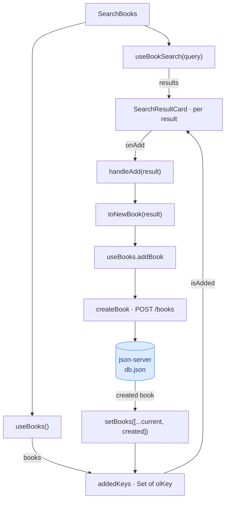

# 07 — Add-to-List + "Already Added" Detection

> How it actually works, read off the diff.
> Spec: [context/features/07-add-to-list.md](../features/07-add-to-list.md)
> Commits: `1deb87e` (implementation) → merged in `55df4f2`
> Base for the diff: `fb3fd9c`
> Follow-up: `7f72d03` corrected the comment above the added-keys set.

---

## 1. What this feature does, in plain language

Search for a book, press **Add**, and it appears on your reading list — as
_Want to Read_, with no score, and with a link back to its Open Library page.
Search again later and that same book no longer offers an Add button. It says
**Already Added**, and it says so before you touch anything.

That second sentence is the entire reason this is its own feature. Feature 06
could ask Open Library a question and draw the answer. This one has to hold two
lists in its head at once — what Open Library just returned, and what is already
in `db.json` — and decide, per card, whether they are the same book.

"The same book" is where it gets interesting. A search for "The Hobbit" returns
Tolkien's work, a Charles Dixon graphic-novel adaptation also called _The
Hobbit_, a Jude Fisher movie companion also called _The Hobbit_, and a dozen
things about it. Matching on the title would mark all of them as added the
moment you add any one of them. So nothing here ever compares titles. It
compares `olKey` — Open Library's own identifier for a work, `/works/OL27482W` —
which has been carried through the codebase, prefix intact, since feature 01
seeded it and feature 06 stored it on `SearchResult`.

---

## 2. Files, and the job each one does

No new files. Eight touched, and the shape of the change is a thin line pushed
down through layers that already existed.

| File | Change |
| ---- | ------ |
| [src/types/book.ts](../../src/types/book.ts) | `NewBook` — a `Book` minus its `id`, which is the server's to assign. |
| [src/lib/json-server.ts](../../src/lib/json-server.ts) | `createBook` — `POST /books`, returning the created record. |
| [src/lib/open-library.ts](../../src/lib/open-library.ts) | `toNewBook` — one search result translated into a reading-list book. |
| [src/hooks/useBooks.ts](../../src/hooks/useBooks.ts) | An `addBook` mutation that appends what came back. |
| [src/components/search/SearchBooks.tsx](../../src/components/search/SearchBooks.tsx) | The wiring: both hooks, the key set, the add handler, the per-card state. |
| [src/components/search/SearchResultCard.tsx](../../src/components/search/SearchResultCard.tsx) | The card's new last element — a button, or a label. |
| [src/components/books/BookDrawer.tsx](../../src/components/books/BookDrawer.tsx) | A guard on the cover image (see 3.6). |
| [context/current-feature.md](../current-feature.md) | The feature doc. |

Feature 06's note ended by pointing at a seam: "the reading list and the search
view share no data at all yet, which is exactly the seam feature 07 has to
close." This is the closing of it, and it happens in exactly one place —
`SearchBooks` calling both hooks. Neither hook learned about the other.
`useBooks` still has no idea Open Library exists; `useBookSearch` is untouched
by this diff entirely.

---

## 3. How the pieces connect



Follow the arrows from `POST` back round to `KEYS` and you have the answer to
the spec's third acceptance criterion — the card flipping without a re-search.
Nothing tells the card it was added. The book lands in `books`, `addedKeys` is
rebuilt from `books`, the card reads `isAdded` from `addedKeys`, and it renders
a label instead of a button. It is a loop, not a message.

### 3.1 `toNewBook`, and the three fields Open Library never sent

A `Book` needs nine fields. A `SearchResult` carries five, and one of those is
the id we must not send. [open-library.ts:65](../../src/lib/open-library.ts#L65)
fills the gaps:

| Field | Where it comes from |
| ----- | ------------------- |
| `title`, `author`, `coverUrl`, `olKey` | Straight from the search result. |
| `status` | `"want_to_read"` — the spec's default. |
| `score` | `0` — **not** the card's stars. |
| `type` | The constant `"Unknown"`. |
| `link` | `https://openlibrary.org` + `olKey`. |
| `id` | Nothing. The type forbids it. |

The three invented ones are each a small judgement:

**`score: 0`** looks wrong next to a card showing four stars, and isn't. Those
stars are `ratings_average`, Open Library's community rating — feature 06 asked
for the field by name specifically to draw them. The score in the reading list
is the user's own rating of a book they have not read yet. Copying the crowd's
opinion into that column would be putting words in their mouth. The comment at
[open-library.ts:71](../../src/lib/open-library.ts#L71) is there because this is
the kind of line a later reader "fixes".

**`type: "Unknown"`.** The search response has no genre field. The closest thing
is `subject`, and Open Library's subjects are crowd-edited: a work's first
subject is as likely to be "Accessible book" or "Protected DAISY" as "Fiction".
Requesting it would also have meant editing feature 06's `fields=` list to get a
value that is wrong often enough to be noise. The Type column is the user's to
fill in, so a new book says plainly that nobody has.

**`link`.** `olKey` is `/works/OL27482W`; the work's page is that path on
`openlibrary.org`. This is why the prefix has been preserved since feature 01 —
it is both the identifier and the URL, and stripping it would have cost a
rebuild on both sides.

### 3.2 `createBook`, and why it bothers with the response

[json-server.ts:26](../../src/lib/json-server.ts#L26) follows the shape the file
already had — `let response` outside the `try`, a bare `catch` converting a
network failure into the "is json-server running on port 3001" message, a status
check, then the JSON.

It returns `Promise<Book>`, not `void`. `updateBookStatus` returns the book for
one reason (read the server's truth, not what you hoped you wrote), `deleteBook`
returns nothing for another (there is nothing left to describe). `createBook`
has a third: **the id doesn't exist until the server makes one.** json-server v1
generates a string id — `nlKHOnH2Bhw`, not `7` — and React needs it as the row
key the moment the book joins the table. There is no way to know it except by
reading the response.

### 3.3 `addBook` on `useBooks`

[useBooks.ts:57](../../src/hooks/useBooks.ts#L57):

```ts
const addBook = useCallback(async (book: NewBook) => {
  const created = await createBook(book);
  setBooks((current) => [...current, created]);
}, []);
```

Six lines that copy two decisions from features 04 and 05 rather than
re-litigating them:

- **It rejects instead of setting `error`.** The hook's `error` is the
  load failure, and it swaps the entire table for an error panel. That is right
  when the list couldn't be fetched and badly wrong when one POST failed — you
  would lose the whole screen because one Add didn't take. So the failure
  travels up the promise, and the caller reports it next to the control the user
  actually used.
- **It appends rather than refetching.** The list is now exactly what is held
  here plus the book that came back. A `GET /books` would spend a round trip
  learning that.

It takes a `NewBook`, not a `SearchResult` — which is why the mapping happens at
the call site. `useBooks` is the reading list's hook; teaching it to read Open
Library's shapes would put the search feature inside the home page's data layer.

### 3.4 The key set, and the state that isn't in it

[SearchBooks.tsx:46](../../src/components/search/SearchBooks.tsx#L46):

```ts
const addedKeys = useMemo(
  () => new Set(books.map((book) => book.olKey)),
  [books],
);
```

A `Set` rather than `books.some(...)` inside the render loop: with 24 cards the
difference is 24 lookups against 24 scans of the list. Memoized on `books`, so
it is rebuilt when the list changes and not when someone types a letter into the
search box — and typing re-renders this component constantly.

What matters more is what **isn't** here. There is no `addedThisSession` state,
no flag on the card, no local copy of "books I have added". Every card asks the
same question of the same source: is my `olKey` in the list the hook is holding?
That is why re-running a search shows the right answer, why navigating home and
back shows the right answer, and why the flip after adding needs no special case
at all — it is the same code path as a book you added last week.

### 3.5 Two pieces of per-card state, keyed by `olKey`

```ts
const [addingKey, setAddingKey] = useState<string | null>(null);
const [addError, setAddError] = useState<AddError | null>(null);
```

Not `isAdding: boolean`. The grid has two dozen buttons, and a boolean would
disable all of them and report one failure under all of them.
[SearchBooks.tsx:51](../../src/components/search/SearchBooks.tsx#L51) is the
handler, and the last line is the one worth reading twice:

```ts
setAddingKey((current) => (current === result.olKey ? null : current));
```

Clear the in-flight marker only if it is still _mine_. If a second Add started
while the first was in the air, `addingKey` now belongs to that second card, and
clearing it unconditionally would un-disable a button whose request is still
running. This is the same guard `BookDrawer` uses on `savingBookId` and
`deletingBookId`, for the same reason — a late response must not describe the
present.

`AddError` carries the `olKey` it belongs to for the matching reason: a rejection
that lands after you have clicked another card is reported on the card it was
actually for.

### 3.6 The card, and the empty-cover bug this surfaced

[SearchResultCard.tsx:53](../../src/components/search/SearchResultCard.tsx#L53)
is the design's fork — the `Already Added` span, or the `Add` button — with three
things the design has no notion of: the disabled `Adding…` label, the failure
message, and an `aria-label` naming the book, since two dozen buttons all reading
"Add" tell a screen-reader user nothing about which is which.

The button sits inside a plain `<div>` rather than carrying the design's
`align-self: flex-start` itself. That looks like noise and isn't: `flex-start`
shrinks the column to its widest child, and the widest child can be a sentence
about json-server not running, which would then hang out past the 230px card.
Inside a full-width block the button still sizes to its own content, so the
design's look survives and the error wraps.

The drawer change in this diff is a real defect this feature created. `toNewBook`
stores `coverUrl: ""` when Open Library has no cover, because the `Book` schema
has no null cover. `next/image` treats an empty `src` as an error rather than as
nothing to draw — so the first coverless book added would have broken the drawer.
[BookDrawer.tsx:162](../../src/components/books/BookDrawer.tsx#L162) now guards
it exactly as the search card always has, leaving the striped placeholder alone
underneath. Both were verified in the browser against a real coverless result.

---

## 4. Spec vs. what shipped

| Spec requirement | What shipped |
| ---------------- | ------------ |
| Add button on each result card | Yes — the design's own button. |
| `POST /books` with mapped fields, `want_to_read`, `score: 0`, `olKey` from `key` | Yes. Three fields with no source in the response are invented — see 3.1. |
| Fetch `GET /books` and compare `key` against `olKey`, never title | Yes, via `useBooks`, as a memoized `Set`. |
| Disabled "Already Added" label on a match | The design's muted span, which is inherently non-interactive. |
| Card flips immediately after adding, no re-search | Yes — as a consequence of deriving from the list, not as a special case. |

**Acceptance criteria**, all three checked in the browser against a live
json-server before the merge: the created record carried all nine fields with
`olKey` verbatim; Tolkien's _Hobbit_ showed "Already Added" while two unrelated
works also titled _The Hobbit_ correctly still offered Add; and a card flipped
the moment its POST resolved.

### Three things that shipped which the spec did not ask for

- **The `Adding…` disabled state**, following the drawer's `Deleting…`.
- **A per-card failure message**, since `coding-standards.md` forbids letting a
  failed fetch render nothing. Verified by patching `fetch` in the page to reject
  the POST.
- **A notice when `GET /books` fails.** Without the list there is nothing to
  compare against, and every card would quietly offer to add a book that may
  already be there — "Already Added" would stop being true without saying so.

### Two things left for feature 08

- **A stale add-error can outlive its search.** Fail an add, refine the query,
  and a card for that same book still shows the old message. Consistent with the
  drawer, which keeps a failed save's message while the book stays open.
- **Focus is lost when a card flips.** Press Enter on `Add` and the button
  unmounts, dropping focus to the body. Inherent to what the spec and design ask
  for — a disabled button would not hold focus either — so fixing it means
  deciding where focus should go.

---

## 5. Where this sits in the sequence

This is the last of the CRUD verbs. `GET` arrived in 02, `PATCH` in 04, `DELETE`
in 05, and `POST` here — which means `useBooks` is now the complete data layer
the app was specified to have, and `src/lib/json-server.ts` implements every
endpoint listed in `coding-standards.md`.

It is also the first feature whose job was to connect two existing features
rather than add a new surface. That shows in the diff: eight files touched, no
new ones, and the largest single change is 65 lines in the component that already
owned the search screen. Features 04 and 05 supplied the patterns it reaches for
— reject-don't-store, key-by-id, report-next-to-the-control — and the reason
those transplanted cleanly is that they were never about status or deletion
specifically. They were about mutations that can fail while the user is doing
something else.

Feature 08 is the polish pass over every state this app can be in, and the two
items above are its inheritance from this one.

---

## 6. If you want to browse this code as it existed then

Don't check the commit out in place — it would move your working branch. Use a
worktree, which gives you the files in a separate folder and leaves `master`
alone:

```bash
git worktree add ../review-add-to-list 1deb87e
```

To read just the change rather than the whole tree:

```bash
git diff fb3fd9c..1deb87e          # the feature as merged
git show 7f72d03                   # the README entry and comment fix
```

When you're done:

```bash
git worktree remove ../review-add-to-list
```
