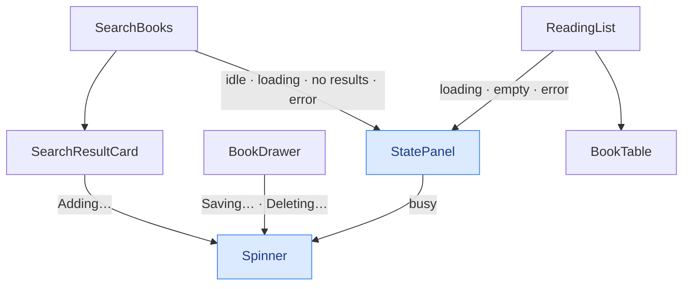

# 08 — Polish: Loading/Empty/Error States

> How it actually works, read off the diff.
> Spec: [context/features/08-polish-states.md](../features/08-polish-states.md)
> Commits: `2194a74` (implementation) → merged in `4da212a`
> Base for the diff: `96cd02d`
> Follow-up: `ad66537` corrected a comment on the relocated author line.

---

## 1. What this feature does, in plain language

Nothing new appears on screen. That is the point.

Features 02 through 07 each shipped their own answer to the same three
questions — what do we show while we are waiting, what do we show when there is
nothing, and what do we show when it breaks. Seven such states existed by the
end of feature 07, written at five different times, and they had drifted:
different padding, different markup, and — the one that actually mattered — the
home page's error was silent to a screen reader while the search view's
announced itself.

This feature collapses all seven into one component, gives every waiting state
the same spinner, and then goes hunting for the fetches whose failure or
in-flight state nobody had defined. It found three, one of which was a real bug
rather than a cosmetic gap. Finally it makes the table survive a phone.

The spec's own note draws the boundary: _"Don't add new functionality here —
only consistency and error handling for what's already built."_ Everything
below is either a consolidation or a hole being filled.

---

## 2. Files, and the job each one does

Two new files. Six touched.

| File | Change |
| ---- | ------ |
| [src/components/ui/StatePanel.tsx](../../src/components/ui/StatePanel.tsx) | **New.** The one shell behind all seven "nothing to render" states. |
| [src/components/ui/Spinner.tsx](../../src/components/ui/Spinner.tsx) | **New.** The one loading indicator, on every surface. |
| [src/components/books/ReadingList.tsx](../../src/components/books/ReadingList.tsx) | Three local panels deleted; header stacks on narrow screens. |
| [src/components/search/SearchBooks.tsx](../../src/components/search/SearchBooks.tsx) | Four local panels deleted; add error tagged; grid waits on the list. |
| [src/components/books/BookDrawer.tsx](../../src/components/books/BookDrawer.tsx) | A `Saving…` state that never existed; failures cleared on close. |
| [src/components/search/SearchResultCard.tsx](../../src/components/search/SearchResultCard.tsx) | Spinner beside `Adding…`. |
| [src/components/books/BookTable.tsx](../../src/components/books/BookTable.tsx) | Columns that hide below 768px; the author relocated. |
| [src/app/page.tsx](../../src/app/page.tsx), [src/app/search/page.tsx](../../src/app/search/page.tsx) | `px-5 sm:px-8`. |

`src/components/ui/` is a new folder. Every component before this belonged to a
feature area (`books/`, `search/`); these two belong to both, which is what the
folder is saying.

---

## 3. How the pieces connect



Both new components are leaves. Nothing imports upward, no hook changed, and
no data flow moved — `useBooks` and `useBookSearch` are untouched by this diff.
That is what made a change across every screen this cheap.

---

## 4. The interesting parts

### 4.1 Why `StatePanel` derives things instead of taking them as props

The obvious shape for a shared panel is a bag of props: pass the padding, pass
the ARIA role, pass the colours. The version that shipped does the opposite for
two of them.

```tsx
role={variant === "error" ? "alert" : undefined}
className={`rounded-xl border px-6 text-center ${
  variant === "error" ? "py-16" : "py-24"
} ${style.surface}`}
```

Both were the *actual* points of drift. The home page's error panel had no
`role="alert"` and the search view's did — not by decision, but because they
were written six weeks apart. The padding had diverged the same way. Making
either one a prop would preserve exactly the freedom that caused the bug: a
future eighth state could pass the wrong one and nobody would notice.

Deriving them means an error panel *cannot* be silent and *cannot* be the wrong
height, because neither is a decision the caller gets to make any more.

The colours stay in a lookup rather than being computed, for a reason feature 02
already hit:

```tsx
const STYLES: Record<PanelTone, Record<PanelVariant, PanelStyle>> = {
  light: { card: { surface: "border-stone-200 bg-white shadow-sm", ... } },
  dark:  { card: { surface: "border-dark-border bg-dark-card", ... } },
};
```

Six entries written out in full, because Tailwind scans source for complete
class strings. `` `border-${tone}-border` `` would produce a class that exists in
the markup and in no stylesheet. `StatusBadge` carries the same comment for the
same reason.

### 4.2 `Spinner` has no `tone` prop, and that is deliberate

`StarScore` — the closest precedent — takes `tone="light" | "dark"`, because the
colour of an empty star genuinely differs per surface. The spinner needs to work
on four surfaces: the white table panel, the dark search panel, a stone-900
button, and a red delete button. By that precedent it should take four tones.

Instead:

```tsx
className="... border-2 border-current border-t-transparent ..."
```

`border-current` resolves to whatever `color` the parent has already set. Inside
`text-white` buttons it is white; inside the panel's `text-stone-500` message it
is grey; inside `text-dark-muted` it is the search view's muted blue. The prop
disappears because the information was already in the DOM.

That is why `StatePanel` renders the spinner *inside* an element carrying the
message colour rather than beside it:

```tsx
{busy && (
  <p className={`mb-3 ${style.message}`}>
    <Spinner size="md" />
  </p>
)}
```

The `<p>` exists to donate its colour.

Two smaller choices. `aria-hidden="true"` is unconditional — every placement
pairs the spinner with visible text (`Loading your books…`, `Adding…`,
`Deleting…`, `Saving…`), so announcing the spinner as well would only repeat
what is already being read. And `motion-reduce:animate-none` stops the rotation
for anyone who has asked the OS for reduced motion; the text still carries the
meaning, so nothing is lost by freezing it.

### 4.3 The state that did not exist

Before this feature, changing a book's status did this while the PATCH was in
flight: greyed out the select. That was the entire feedback. If json-server was
slow, the UI was indistinguishable from a control that had simply stopped
working.

```tsx
{savingBookId === book.id && (
  <p role="status" className="mt-2 flex items-center gap-1.5 ...">
    <Spinner />
    Saving…
  </p>
)}
{saveError?.bookId === book.id && ( ... )}
```

It renders in the slot directly above the failure message, which means the two
can never appear together — `savingBookId` is cleared in the `finally` that runs
before the error is displayed. `role="status"` announces it politely, matching
the `role="alert"` on the failure below it.

This is the acceptance criterion _"every fetch has a defined loading, success,
and error state"_ being applied literally to the one fetch that failed it.

### 4.4 The add error that outlived its search

Feature 07 left this open by name. The bug: `addError` is component state, so a
failure raised while searching "dune" survived a change of query. Search
something else, and if the new results happened to contain that same work, the
old failure reappeared underneath it.

The obvious fix is to clear the error when the query changes — a `useEffect` on
`trimmedQuery`, or a `setAddError(null)` in the input's `onChange`. The effect
version is rejected outright by lint's `set-state-in-effect`, which is the same
rule that shaped `useBookSearch` in feature 06. The `onChange` version passes
lint but is incomplete, and the reason is worth sitting with:

> a rejection can land *after* the query has already changed

`handleAdd` is async. If the POST fails 800ms after the user has typed something
new, `setAddError` runs at that point and re-populates state that `onChange`
already cleared. Clearing on keystroke cannot catch a write that happens later.

So the error carries its own context instead:

```tsx
interface AddError {
  olKey: string;
  query: string;
  message: string;
}
```

and the card only receives it while both still match:

```tsx
error={
  addError?.olKey === result.olKey && addError.query === trimmedQuery
    ? addError.message
    : null
}
```

A late rejection still writes to state — it just writes a record tagged with a
query nobody is looking at any more, so it is never rendered. This is exactly
the shape `useBookSearch` uses for its results (`settled.query === trimmed`),
which is the point: the file already contained the answer.

### 4.5 Drawer failures now clear on close

Same class of bug, found by looking for it rather than by report. `saveError`
and `deleteError` are keyed by book id, which correctly stops a failure being
shown against the *wrong* book — but does nothing about showing it against the
*right* book much later. Fail a save, close the drawer, reopen the same book:
the message was still there, presenting a dead request as if it had just
happened.

```tsx
function handleClose() {
  if (deletingBookId !== null) return;
  setConfirmingBookId(null);
  setSaveError(null);
  setDeleteError(null);
  onClose();
}
```

It sits behind the existing mid-delete guard, which feature 05 added so that
leaving during a request cannot unmount the element its failure renders in.

### 4.6 The one gap that was a real bug

The other two were cosmetic. This one could write bad data.

`SearchBooks` calls `useBooks()` purely to build `addedKeys`, the set that
decides whether a card says **Add** or **Already Added**. Until `GET /books`
resolves, `books` is `[]`, so `addedKeys` is empty, so *every* card offers to
add — including books already on the list. Click one and you get a duplicate
row, because nothing else in the app checks.

The fix is one condition:

```tsx
} else if (isSearching || isListLoading) {
```

The grid is now unreachable until the list has landed. It costs nothing in
practice — the list arrives from localhost well inside the 400ms search debounce,
so this branch never renders on the list's account — but "never in practice" is
not a state, and the acceptance criterion asks for a defined one.

It also cannot hang: a failed list load sets `error` and clears `isLoading`, so
the branch ends and the existing banner explains that "Already Added" is not to
be trusted this session.

### 4.7 The mobile table, and the road not taken

`project-overview.md` says the table becomes "stacked/simplified rows" below
768px. Until now it did neither — it kept all six columns and scrolled
sideways.

The tempting implementation is CSS-only stacking: `display: block` on the
`<table>`, `<tr>` and `<td>`, then label each cell with a `::before`. It is a
well-known trick and it produces the nicer-looking card layout. It also destroys
the table: applying `display: block` to table elements removes them from the
accessibility tree as a table, so a screen reader stops announcing rows,
columns, and headers entirely.

The slash in "stacked/simplified" allows the other reading, so the diff takes
it:

```tsx
const HIDDEN_ON_MOBILE = "hidden md:table-cell";
```

Type, Score, and Link leave below `md`. It stays a real table with two real
columns. Nothing is lost, because the drawer holds every dropped field and goes
full-screen at exactly the same breakpoint — the table becomes an index, the
drawer becomes the detail view.

The author is the exception, because a list of books without authors is hard to
scan. It moves rather than leaving:

```tsx
<p className="mt-0.5 text-[12.5px] text-stone-500 md:hidden">{book.author}</p>
```

It is now in the DOM twice — once here, once in its own `<td>`. Exactly one is
ever visible, and `hidden` is `display: none`, which removes the other from the
accessibility tree too, so it is never announced twice. `whitespace-nowrap` also
became `md:whitespace-nowrap` on the title cell, or a long title would
reintroduce the horizontal scroll this was meant to remove.

`ad66537` fixed a comment here that claimed the relocated author sat outside the
row's click target. It does not — the `<tr>`'s `onClick` fires on bubble, so
tapping the author opens the drawer like any other part of the row. The
behaviour was right; the comment was wrong.

### 4.8 The header

`flex items-center justify-between` put a 28px heading and a button on one line.
At 375px they overrun it. Shrinking either would mean deviating from the design
at every width, so instead they stack below `sm` and the design's row resumes
above it:

```tsx
className="mb-8 flex flex-col items-start gap-4 sm:flex-row sm:items-center sm:justify-between sm:gap-6"
```

---

## 5. How this connects to what came before

Every decision in this feature was made once already, somewhere else, and this
is largely the diff that notices:

- `role="alert"` on failures — feature 06's search error had it; feature 02's
  table error did not. Now neither can choose.
- Errors keyed by identity — features 04, 05 and 07 each arrived at it
  independently. This feature adds the missing half: they need a *lifetime* too,
  not just an owner.
- Tag-and-derive over stored state — feature 06 was pushed into it by a lint
  rule. Here it is chosen deliberately, because it solves a race that clearing
  cannot.
- Rejecting rather than setting the hook's `error` — features 04, 05 and 07.
  Unchanged; this feature just made the per-control reporting consistent.

The design file (`Reading List.dc.html`) contributed almost nothing, and that is
itself worth recording: it has no loading indicator, no error state, and no
responsive treatment at all — its drawer is a fixed 400px panel at
`max-width:92vw` and its table never restacks. Its empty state is the single
exception, and the home page had already matched it in feature 02. Everything
else here was built against `project-overview.md`'s responsive rules instead.

---

## 6. What was deliberately left out

Feature 07 left two items for this one. Only one was in scope.

Focus drops to `<body>` when a card flips from **Add** to **Already Added** —
the focused button unmounts, so a keyboard user loses their place and gets no
confirmation that the add succeeded. It is a real defect, and it is focus
management, not a loading or error state. The spec's Notes say to add nothing
beyond consistency and error handling, so it stayed open rather than quietly
widening the feature.

The search view's list-error banner also stayed outside `StatePanel`. It looks
like a candidate — same red, same message shape — but it does a different job:
it warns *alongside* live results rather than standing in *place* of them. A
96px-tall centred panel is the wrong body for that, so it kept its compact
banner form.
